<div class="MCWHeader1">
Azure Stack
</div>

<div class="MCWHeader2">
Hands-on lab step-by-step
</div>

<div class="MCWHeader3">
June 2018
</div>
Information in this document, including URL and other Internet Web site references, is subject to change without notice. Unless otherwise noted, the example companies, organizations, products, domain names, e-mail addresses, logos, people, places, and events depicted herein are fictitious, and no association with any real company, organization, product, domain name, e-mail address, logo, person, place or event is intended or should be inferred. Complying with all applicable copyright laws is the responsibility of the user. Without limiting the rights under copyright, no part of this document may be reproduced, stored in or introduced into a retrieval system, or transmitted in any form or by any means (electronic, mechanical, photocopying, recording, or otherwise), or for any purpose, without the express written permission of Microsoft Corporation.

Microsoft may have patents, patent applications, trademarks, copyrights, or other intellectual property rights covering subject matter in this document. Except as expressly provided in any written license agreement from Microsoft, the furnishing of this document does not give you any license to these patents, trademarks, copyrights, or other intellectual property.

The names of manufacturers, products, or URLs are provided for informational purposes only and Microsoft makes no representations and warranties, either expressed, implied, or statutory, regarding these manufacturers or the use of the products with any Microsoft technologies. The inclusion of a manufacturer or product does not imply endorsement of Microsoft of the manufacturer or product. Links may be provided to third party sites. Such sites are not under the control of Microsoft and Microsoft is not responsible for the contents of any linked site or any link contained in a linked site, or any changes or updates to such sites. Microsoft is not responsible for webcasting or any other form of transmission received from any linked site. Microsoft is providing these links to you only as a convenience, and the inclusion of any link does not imply endorsement of Microsoft of the site or the products contained therein.
© 2018 Microsoft Corporation. All rights reserved.

Microsoft and the trademarks listed at https://www.microsoft.com/en-us/legal/intellectualproperty/Trademarks/Usage/General.aspx are trademarks of the Microsoft group of companies. All other trademarks are property of their respective owners.

**Contents**

<!-- TOC -->

- [Azure Stack hands-on lab step-by-step](#azure-stack-hands-on-lab-step-by-step)
    - [Abstract and learning objectives](#abstract-and-learning-objectives)
    - [Overview](#overview)
    - [Solution architecture](#solution-architecture)
    - [Help References](#help-references)
    - [Requirements](#requirements)
    - [Exercise 1: Configure Azure Stack](#exercise-1-configure-azure-stack)
        - [Task 1: Deploy the Azure Stack App Service Resource Provider](#task-1-deploy-the-azure-stack-app-service-resource-provider)
            - [Sub Task 1: Download the Installer and Scripts](#sub-task-1-download-the-installer-and-scripts)
            - [Sub Task 2: Create App Service Scripts](#sub-task-2-create-app-service-scripts)
            - [Sub Task 3: Deploy Supporting File Server](#sub-task-3-deploy-supporting-file-server)
            - [Sub Task 4: Deploying a Supporting SQL Server](#sub-task-4-deploying-a-supporting-sql-server)
            - [Sub Task 5: Setup Application Identity](#sub-task-5-setup-application-identity)
            - [Sub Task 6: Install the App Service Resource Provider](#sub-task-6-install-the-app-service-resource-provider)
        - [Task 2: Deploy the Azure Stack SQL DB Resource Provider](#task-2-deploy-the-azure-stack-sql-db-resource-provider)
        - [Task 3: Create Azure Stack Deployment Taxonomy for Tenets](#task-3-create-azure-stack-deployment-taxonomy-for-tenets)
    - [Exercise 2: Deploy the SQL Hosting Server and DB on Azure Stack](#exercise-2-deploy-the-sql-hosting-server-and-db-on-azure-stack)
        - [Task 1: Create SQL Hosting Server](#task-1-create-sql-hosting-server)
        - [Task 2: Register resource providers in the tenant subscription](#task-2-register-resource-providers-in-the-tenant-subscription)
        - [Task 3: Deploy SQL DB on Azure Stack](#task-3-deploy-sql-db-on-azure-stack)
    - [Exercise 3: Deploy Contoso Financial Web Application](#exercise-3-deploy-contoso-financial-web-application)
        - [Task 1: Create the Web App](#task-1-create-the-web-app)
        - [Task 2: Provision an Azure Storage Account](#task-2-provision-an-azure-storage-account)
        - [Task 3: Update the configuration strings](#task-3-update-the-configuration-strings)
        - [Task 4: Publish the Contoso Financial Web Application](#task-4-publish-the-contoso-financial-web-application)
    - [Exercise 4: Deploy the customer offers Web API](#exercise-4-deploy-the-customer-offers-web-api)
        - [Task 1: Provision the offers Web API App](#task-1-provision-the-offers-web-api-app)
        - [Task 2: Deploy the Contoso.Apps.Financial.Offers project](#task-2-deploy-the-contosoappsfinancialoffers-project)
        - [Task 3: Update the Application Settings of the Web App with the API URL](#task-3-update-the-application-settings-of-the-web-app-with-the-api-url)
    - [Exercise 5: Automating backend processes with Azure functions](#exercise-5-automating-backend-processes-with-azure-functions)
        - [Task 1: Create an Azure function to generate PDF receipts](#task-1-create-an-azure-function-to-generate-pdf-receipts)
    - [Exercise 6: Deploy Contoso Finance Admin website](#exercise-6-deploy-contoso-finance-admin-website)
        - [Task 1: Provision the Contoso Finance Admin Web App](#task-1-provision-the-contoso-finance-admin-web-app)
        - [Task 2: Deploy the call center admin Web App from Visual Studio](#task-2-deploy-the-call-center-admin-web-app-from-visual-studio)
    - [After the hands-on lab](#after-the-hands-on-lab)

<!-- /TOC -->


# Azure Stack hands-on lab step-by-step

## Abstract and learning objectives

This workshop is designed to teach attendees how to design a hybrid cloud architecture using a combination of the Azure public cloud and Azure Stack. This functional architecture will enable customers to leverage their investments in Azure as a "cloud platform," rather than Azure as a "place." Attendees will learn to determine which systems are good candidates for the Azure public cloud and which are better suited on Azure Stack.

After completing workshop, attendees will be better able to recommend and design hybrid cloud systems that leverage one application and deployment model: Azure.

In addition, attendees will learn to:

-   Understand when the Azure public cloud versus Azure Stack is appropriate based on customer requirements.

-   Describe possible integrations between Azure public cloud solutions and Azure Stack

-   Understand the taxonomy of Azure Stack: tenants, regions, subscriptions, offers, plans, services and quotas.

-   Describe the resource providers that are available for use with Azure Stack

-   Design and deploy hybrid connectivity between Azure public cloud and Azure Stack.

## Overview

In this hands-on lab, you will deploy the Azure Stack Development Kit and deploy the SQL Database and Azure App Service resource providers as well as download several virtual machine images from the Azure Stack Marketplace. From there, you will implement a full taxonomy in Azure Stack consisting of a region, subscription, plan, offer, and quotas. After Azure Stack is configured, you will then deploy Azure SQL Database, Web and API apps and then deploy the Contoso application.

## Solution architecture


## Help References
|    |            |
|----------|:-------------:|
| **Description** | **Links** |
| Azure Stack overview  | <https://azure.microsoft.com/en-us/overview/azure-stack/> |
| Azure Stack use cases | <https://azure.microsoft.com/en-us/overview/azure-stack/use-cases/> |
| Azure Stack features | <https://docs.microsoft.com/en-us/azure/azure-stack/azure-stack-key-features> |
| Azure Stack planning considerations | <https://docs.microsoft.com/en-us/azure/azure-stack/azure-stack-planning-considerations> |
| Azure Stack documentation | <https://docs.microsoft.com/en-us/azure/azure-stack/> |
| Azure Stack Operator documentation | <https://docs.microsoft.com/en-us/azure/azure-stack/> |
| Azure Stack networking | <https://docs.microsoft.com/en-us/azure/azure-stack/user/azure-stack-network-overview/> |
| Azure Stack to Azure Global VPN | <https://docs.microsoft.com/en-us/azure/azure-stack/azure-stack-connect-vpn> |
| Register Azure Stack with your subscription | <https://docs.microsoft.com/en-us/azure/azure-stack/azure-stack-register> |
| Deploy the Azure Stack App Service resource provider | <https://docs.microsoft.com/en-us/azure/azure-stack/azure-stack-app-service-deploy> |
| Deploy the Azure Stack SQL resource provider | <https://docs.microsoft.com/en-us/azure/azure-stack/azure-stack-sql-resource-provider-deploy#deploy-the-resource-provider> |
| Deploy apps to Azure and Azure Stack | <https://docs.microsoft.com/en-us/azure/azure-stack/user/azure-stack-solution-pipeline> |
| White paper | <https://azure.microsoft.com/en-us/resources/azure-stack-an-extension-of-azure/> |
| PowerShell for Azure Stack | <https://docs.microsoft.com/en-us/azure/azure-stack/user/azure-stack-powershell-install> |
| Azure Stack marketplace | <https://docs.microsoft.com/en-us/azure/azure-stack/azure-stack-marketplace-azure-items> |


## Requirements

-   Microsoft Azure subscription 


## Exercise 1: Configure Azure Stack

Duration: 2-3 hours

In this exercise, you will configure the Azure Stack environment for the lab. You will install the resource providers for Azure SQL Database and Azure App Service, from there you will configure the taxonomy for the Azure Stack hands-on lab.

Tip: To minimize prompts from PowerShell, set your execution policy to bypass

Set-ExecutionPolicy -ExecutionPolicy Bypass -Scope CurrentUser

### Task 1: Deploy the Azure Stack App Service Resource Provider

#### Sub Task 1: Download the Installer and Scripts

1.  Download the installer executable from <https://aka.ms/appsvconmasinstaller> and helper scripts zip file from <https://aka.ms/appsvconmashelpers> to the **C:\\HOL\\** folder on the Azure Stack Host. The following files and folder structure appear after extracting the helper scripts zip:

    

The following screenshot shows the installer executable:

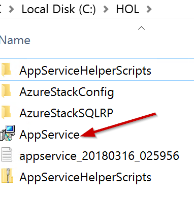

#### Sub Task 2: Create App Service Scripts

1.  Change to the **AppServiceHelperScripts** folder by executing the following command in an elevated PowerShell console:

    ```
    CD C:\HOL\AppServiceHelperScripts
    ```

2.  Create certificates that the Azure App service resource provider will need by running the following command:

    ```
    .\Create-AppServiceCerts.ps1
    ```

When prompted use the following values:

-   .pfx password use **demo\@pass123**

-   DomainName: **local.azurestack.external**

    The script creates four certificates in the C:\\HOL\\AppServiceHelperScripts folder. The four certificates created by this script are shown in the following table:

  |    |            |
|----------|:-------------:|
| **File name** | **Use** |
| \_.appservice.local.azurestack.external.pfx  | App Service default SSL certificate |
| Api.appservice.local.azurestack.external.pfx | App Service API SSL certificate |
| ftp.appservice.local.azurestack.external.pfx | App Service publisher SSL certificate |
| Sso.appservice.local.azurestack.external.pfx | App Service identity application certificate |

  
3.  Get the Azure Stack Root Certificate by executing the following command:
    ```
    .\Get-AzureStackRootCert.ps1
    ```

**When prompted:**

-   PrivilegedEndpoint: AzS-ERCS01

-   User name: azurestack\\cloudadmin

-   Password: demo\@pass123

#### Sub Task 3: Deploy Supporting File Server

**Note:** Azure App Service requires the use of a file server. You will use an ARM template to create a standalone file server for App Service.

1.  Launch the Azure Stack Administration portal if it isn't open.

2.  Deploy the template to the Azure Stack portal by clicking New and search for **Template Deployment**, click the result and then click the **Create button**. Within the new template deployment blade click **Edit Template**.

3.  Within the Edit Template blade, click **Quickstart template**, and then in the dropdown list choose **appservice-fileservice-standalone**, click **OK** and then **Save**.

    

4.  Specify **demo\@pass123** for the three password parameters.

    

5.  Use **AzSHOLFS** as the new resource group name and click **Create**. It may take 10-15 minutes to complete provisioning.

**NOTE:** The ARM template automatically creates the local users needed for the App Service Resource Provider.

6.  After the template deployment is complete, open the new virtual machine from clicking on **Virtual Machines, FileServerVM** and Note the Public IP address/DNS name label for later reference

    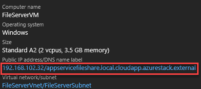

7.  Connect to the new file server virtual machine by clicking **Virtual Machines**, **FileServerVM**, and then **Connect** and login using the following credentials

    -   User: fileshareowner

    -   Password: demo\@pass123

        

        

8.  Next you need to provision the content share on the file server. Launch an elevated console from within the VM by opening the run dialog and entering **cmd** then pressing **enter**, and then execute the following commands.
    ```
    set WEBSITES_SHARE=WebSites

    set WEBSITES_FOLDER=C:\WebSites

    md %WEBSITES_FOLDER%

    net share %WEBSITES_SHARE% /delete

    net share %WEBSITES_SHARE%=%WEBSITES_FOLDER% /grant:Everyone,full

    ```

    9.  Next up is to configure access control to the shares. To configure access run the following commands at an elevated command prompt on the file server. Replace values in italics with values that are specific to your environment.

    ```
    set WEBSITES_FOLDER=C:\WebSites

    icacls %WEBSITES_FOLDER% /reset

    icacls %WEBSITES_FOLDER% /grant FileShareOwner:(OI)(CI)(F)

    icacls %WEBSITES_FOLDER% /inheritance:r

    icacls %WEBSITES_FOLDER% /grant FileShareUser:(CI)(S,X,RA)

    icacls %WEBSITES_FOLDER% /grant *S-1-1-0:(OI)(CI)(IO)(RA,REA,RD)
    ```

#### Sub Task 4: Deploying a Supporting SQL Server 

1.  From the Azure Stack Admin Portal, click **+ New, Compute, Free SQL Server License: SQL Server 2017 Developer on Windows Server 2016**, and then click **Create**.

    

2.  Specify the following configuration on the Basics blade and click OK:

-   Name: SQLServerVM

-   User name: sqlserveradmin

-   Password: demo\@pass123

-   Resource Group: SQLServerRG

    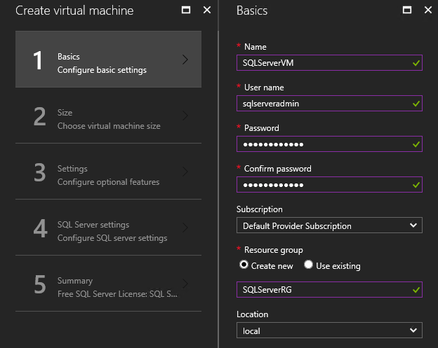

3.  Find and select A3 Standard as the virtual machine size and click **Select.**

    -   

4.  On the Settings blade, click **Network security group (firewall)** and then click **+ Add an inbound rule.** Change the service to **MS SQL** and click **OK** until you are back to the settings blade.

    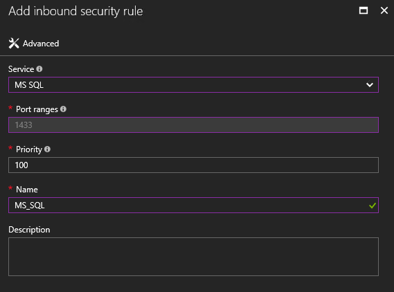

5.  Click **Public IP address**, and then click **Create New**. Change the assignment to **Static**.

    

6.  Click **OK** on the settings blade to continue.

7.  On the **SQL Server settings** blade make the following changes and then click **OK.**

-   SQL connectivity: Public (Internet)

-   SQL Authentication: Enable

    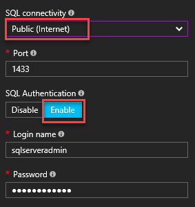

8.  Click **OK** on the summary blade to create the VM (this VM may take 10-15 minutes to provision).

9.  Note the Public IP address of the VM for later reference.

#### Sub Task 5: Setup Application Identity

1.  Switch back to the Azure Stack host to configure an Azure AD Service Principal for Azure Functions.

2.  Launch an elevated PowerShell instance (ensure you are logged in as azurestack\\AzureStackAdmin) and run the following commands:

```
    CD C:\HOL\AppServiceHelperScripts

    .\Create-AADIdentityApp.ps1
```

When prompted specify the following:

-   DirectoryTenantName: \[your tenant name\].onmicrosoft.com

-   AdminArmEndpoint: adminmanagement.local.azurestack.external

-   TenantArmEndpoint: management.local.azurestack.external

-   CertificateFilePath: C:\\HOL\\AppServiceHelperScripts\\sso.appservice.local.azurestack.external.pfx

-   CertificatePassword: demo\@pass123

-   Login with your Azure credentials when prompted

3.  Note the application ID created (yours will be different).

    

4.  Switch the Azure Portal (<https://portal.azure.com>) and click Azure Active Directory on the navigation or under All Services.

5.  Select **App Registrations**, and change the drop down to All apps, then search for the application ID noted earlier.

    

6.  Select the **App Service** returned from search results and then click **Settings -\> Required Permissions.**

    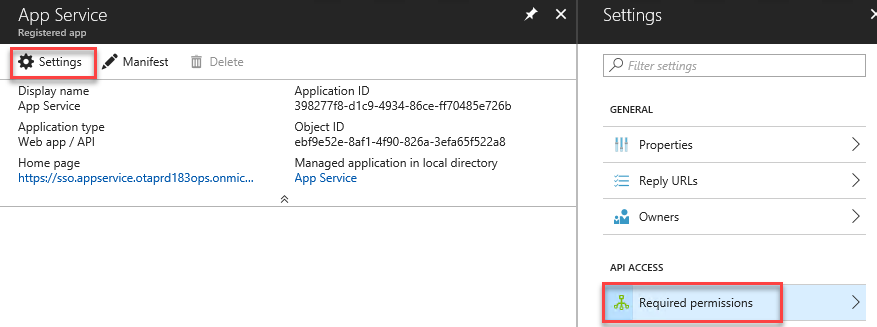

7.  Select **Grant Permissions** and click **Yes**.

#### Sub Task 6: Install the App Service Resource Provider

1.  Next start the Azure Stack App Service resource provider deployment by navigating to C:\\HOL folder using File Explorer, and double click the **AppService.msi** file to start the installation.

2.  Click **Deploy App Service or upgrade to the latest version**.

    

3.  Review and accept the Microsoft Software License Terms and then click **Next**.

4.  Review and accept the third-party license terms and then click **Next**.

5.  Review the settings and click **Next**.

    

6.  Click Connect, and then specify your Azure subscription information. After logging in, click the dropdown by the subscription and location dropdown to specify the correct configuration.

    

7.  Accept the defaults on the network configuration by clicking next.

    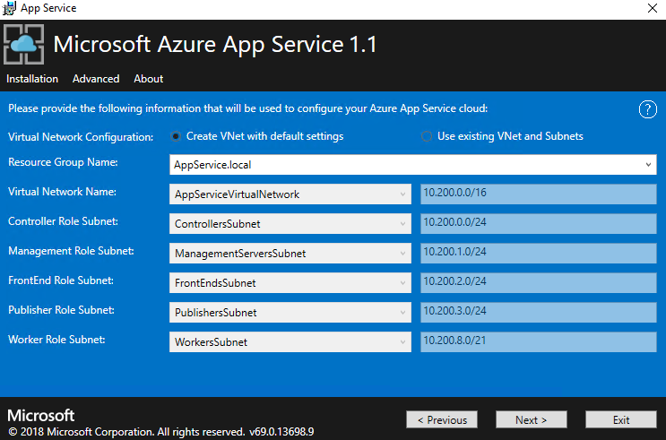

8.  Specify the following configuration for the file share:

-   File Share UNC Path: (use the public IP from your file server noted earlier)

-   File Share Owner: fileshareowner

-   File Share Owner Password: demo\@pass123

-   File Share User: fileshareuser

-   File Share User Password: demo\@pass123

    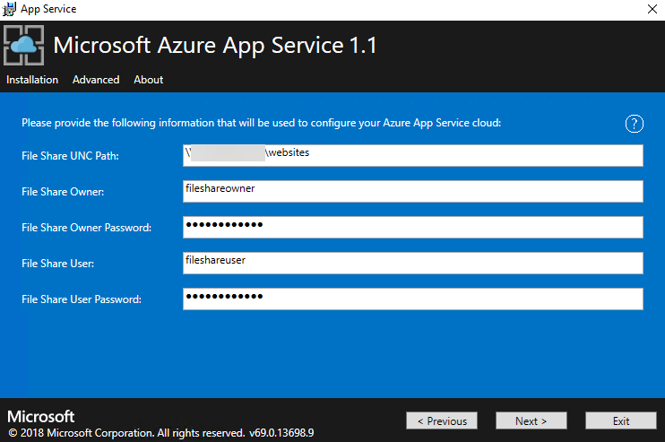

9.  On the next screen, paste in the application id created earlier and specify the following certificate information:

-   Identity Application ID: your application id key created earlier

-   Identity Application Certificate (\*.pfx): C:\\HOL\\AppServiceHelperScripts\\sso.appservice.local.azurestack.external.pfx

-   Identity Application Certificate (\*.pfx) Password: demo\@pass123

-   Azure Resource Manager (ARM) root certificate file (\*.cer): C:\\HOL\\AzureStackCertificationAuthory.cer

    

10. On the next page you will specify the remaining certificates:

-   App Service default SSL certificate file (\*.pfx) : C:\\HOL\\AppServiceHelperScripts\\\_.appservice.local.azurestack.external.pfx

-   App Service API SSL certificate file (\*.pfx): C:\\HOL\\AppServiceHelperScripts\\api.appservice.local.azurestack.external.pfx

-   App Service Publisher certificate file (\*.pfx): C:\\HOL\\AppServiceHelperScripts\\ftp.appservice.local.azurestack.external.pfx

    

11. On the next screen, specify the public IP and the credentials for your SQL Server VM and click **Next**.

    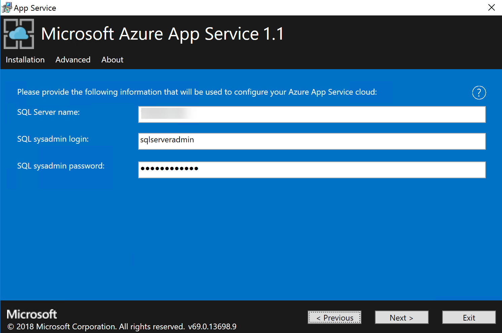

12. Accept the defaults for the VMs to provision for the App Service resource provider by clicking **Next**.

    

13. Except the default for the platform image by clicking **Next**.

    

14. Specify the following user account for both administrator accounts and click Next.

-   User name: appserviceadmin

-   Password: demo\@pass123

    

15. Click the Checkbox next to Select and click next to start the deployment and then click **Next**.

    

16. The final step is to validate the App Service on Azure Stack installation. TO validate the App Service installation perform the following 2 steps:

    -   In the Azure Stack admin portal, go to **Administration - App Service**.

    -   In the overview under status, check to see that the **Status** shows **All roles are ready**.

### Task 2: Deploy the Azure Stack SQL DB Resource Provider

1.  From the Azure Stack Host, you will need to locate the IP address of the Azure Stack "Privileged Endpoint." Click **Start**, **Windows Administrative Tools** followed by **Hyper-V Manager**.

    

2.  Once Hyper-V Manager loads, you will see all the virtual machines that make up the Azure Stack Development Kit on your host. Locate and click the virtual machine (VM) with the name **AzS-ERCS01**.

    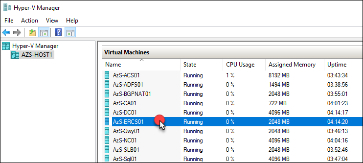

3.  In the bottom pane of Hyper-V Manager, you will see the **AzS-ERCS01** VM with four tabs. Click the **Networking** Tab. Then, take note of the IPv4 address. In the case of the example it is **192.168.200.225**.

    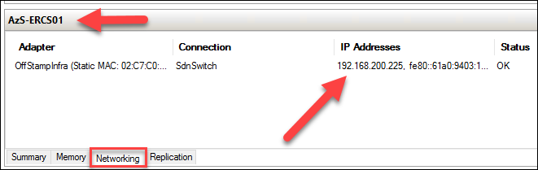

4.  From the Azure Stack Host, open a new Internet Explorer tab and connect to the follow address.

https://docs.microsoft.com/en-us/azure/azure-stack/azure-stack-sql-resource-provider-deploy

5.  From this webpage, download the version of the SQL Resource Provider that matches your version of Azure Stack.

    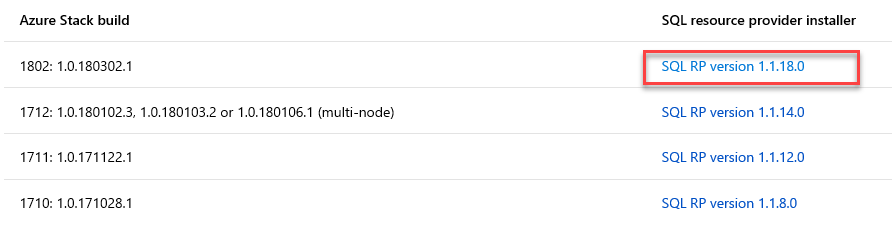

6.  Once it is downloaded, using Windows Explorer on the Azure Stack Host, navigate to your downloads directory. Double click the file to install the package. You will need to click **Run** at the Security Warning prompt.

    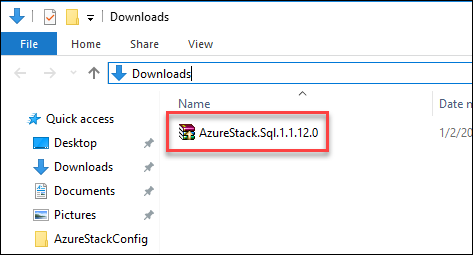

    

7.  Click **Accept** and use the **Browse** and **Make New Folder** buttons to change the destination folder to a new folder named: **C:\\HOL\\AzureStackSQLRP.** Click **Extract**.

    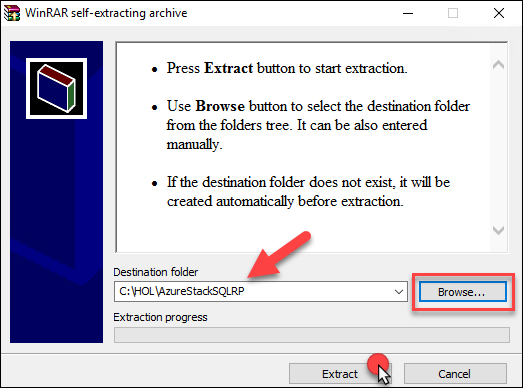

8.  From the elevated PowerShell console, move to the directory where you extracted the SQL RP files: **C:\\HOL\\AzureStackSQLRP**
    ```
    cd C:\HOL\AzureStackSQLRP
    ```

9.  Move back to your Azure Stack Admin portal and check on the download of Windows Server 2016 Datacenter -- Server Core. **This must be downloaded prior to continuing.** If for some reason the download is not complete, you must wait until the image is in the Azure Stack Marketplace prior to moving forward. This is due to the SQL RP using this image.

10. From this directory, run the script DeploySQLProvider.ps1 by executing the following command.
    ```
    .\DeploySQLProvider.ps1
    ```


11. At the **Privileged Endpoint** prompt, enter the **IP Address that you found using Hyper-V Manager**, and click **OK**. In the example the IP is **192.168.200.225.**

    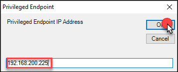

Note: The popup may appear the PowerShell ISE

12. Next, you will be prompted for the **Azure Stack Cloud Admin** credential. Enter the following user name along with your password:

    -   Username: **azurestack\\cloudadmin**

    -   Password: \[your password -- should be the same as your Azure Stack Host Local Admin\].

        

13. Next, you will be prompted for the **Azure Stack Service Admin** credential. Enter the following user name along with your password:

    -   Username: **username\@azureadname.onmicrosoft.com**

    -   Password: \[your password\]

        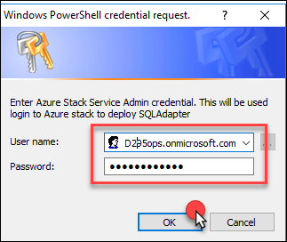

14. Next, you will be prompted for a new local account to be used for the local SQL Adapter VM. Enter the following user name along with your password:

    -   Username: **AzureStackSQLRP**

    -   Password: \[your password\]

        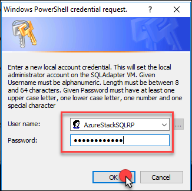

15. You will then be prompted for the Password for the Default SSL Certificate. **Use the same password as the Azure Stack Host Administrator account** and press **OK.**

    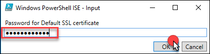

**Note:** The script will run for at least 25 mins. Please wait until it completes prior to moving on to the next step.

16. Once the SQL RP is installed, the following message will appear. Close any Azure Stack portal sessions and restart them to update the portal UI.

    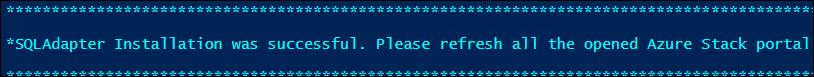

17. Open the Azure Stack Admin portal <https://adminportal.local.azurestack.external>, and navigate to Resource Groups. Notice the new **system.local.sqladapter** resource group. Click on this group.

    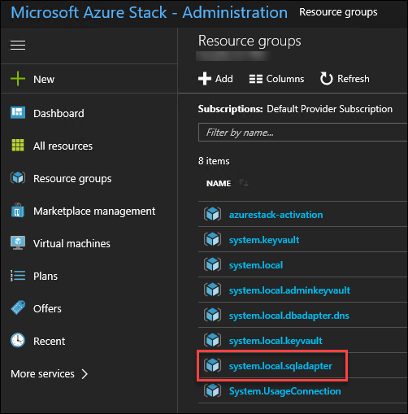

18. This will load the resource group where you can see all the different resources provisioned to allow for the use of the SQL RP.

19. Click **+New** in the Azure Stack Admin portal.

    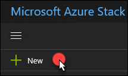

20. Click **Data + Storage** and notice that the **SQL Database** and **SQL HostingServer** now appear as options for you to provision.

    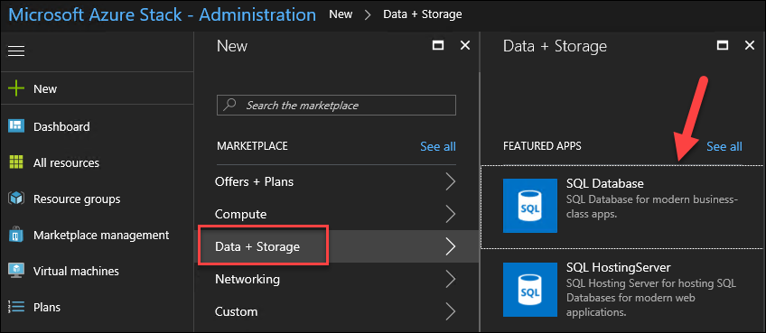

### Task 3: Create Azure Stack Deployment Taxonomy for Tenets


1.  Click **+New** in the Azure Stack Admin portal.

    

2.  Click **Offers + Plans** followed by **Plan**.

    

3.  In the New Plan blade, provide the following inputs:

    -   Display name: **PROD-Plan-1**

    -   Resource name: **prod-plan-1**

    -   Resource group: **ContosoFinance**

        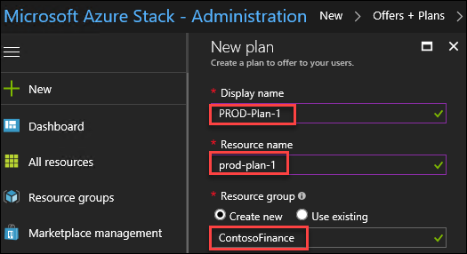

4.  Click **Services**.

    

5.  Next, check each of the **Services** listed, and click **Select**.

    

6.  Click **Quotas**.

    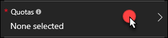

7.  For Quotas, click through and select the default quota presented **[skipping]** the Microsoft.SQL Adapter. Once this is complete, clicking the blade will resemble this example.

    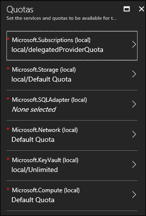

8.  Click the **Microsoft.SQLAdapter,** followed by **Create new quota.**

    

9.  Complete the **Create Quota** blade using these inputs. Then, click **Create**.

    -   Quota Name (no spaces allowed): **SQLQuota**

    -   Maximum size of all databases (GB): **50**

    -   Maximum number of databases: **20**

        

10. Click the **SQLQuota** to assign this to the Microsoft.SQLAdapter.

    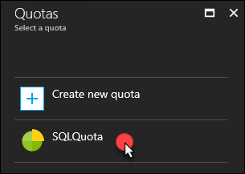

11. Click **OK** on the **Quotas** blade to assign these to **Prod-Plan-1**.

    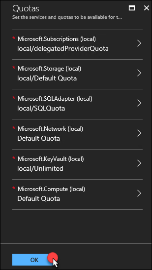

12. Click **Create** to provision the New Plan: **PROD-Plan-1**.

    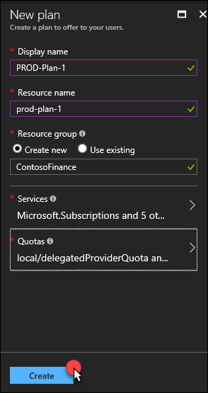

13. The Plan will deploy immediately. Click **+New** in the Azure Stack Admin portal.

    

14. Click **Offers + Plans** followed by **Offer**.

    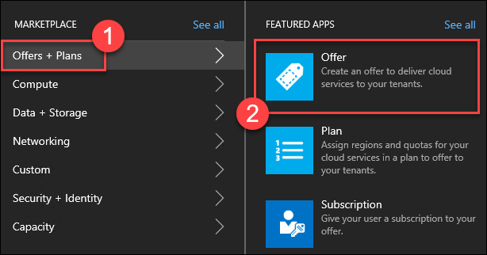

15. Update the New offer blade using the following inputs. Then, click **Create**.

    -   Display Name: **PROD-Offer-1**

    -   Resource Name: **prod-offer-1**

    -   Resource group: **Use existing / ContosoFinance**

    -   Base plans: **PROD-Plan-1**

        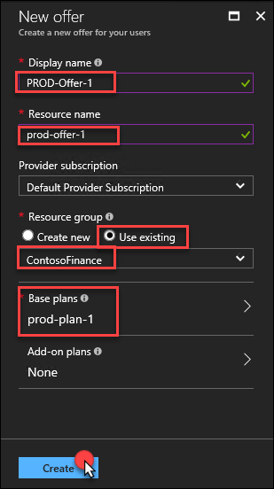

16. In the Azure Stack Admin portal, navigate to the **ContosoFinance** resource group. Here, you can review the new Offer and Plan just created.

    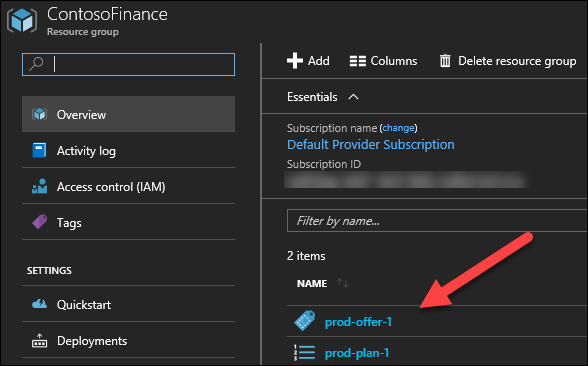

17. Click **prod-offer-1**.

    

18. Notice the portal shows a warning stating: "**This offer is private, and users cannot see it**." To fix this, click the **Change state** button.

    

19. Select **Public**.

    

20. The portal will immediately provide a notification about the update to the offer.

    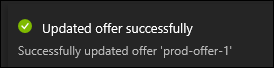

21. Next, open a new browser tab, and navigate to Azure Stack tenant portal <https://portal.local.azurestack.external>. This is the User portal where Contoso Finance will use to provision and manage their Azure Stack service.

    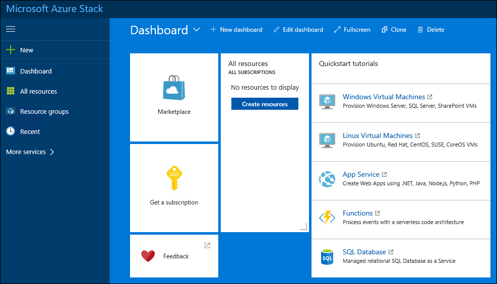

22. Click **Get a subscription.**

    

23. Give it the name: **Production** and select the **PROD-Offer-1**. Click **Create**.

    -   

24. You will need to Refresh the window to start using the new Subscription.

    

25. Once the portal refreshes, click **More Services \> Subscriptions.**

    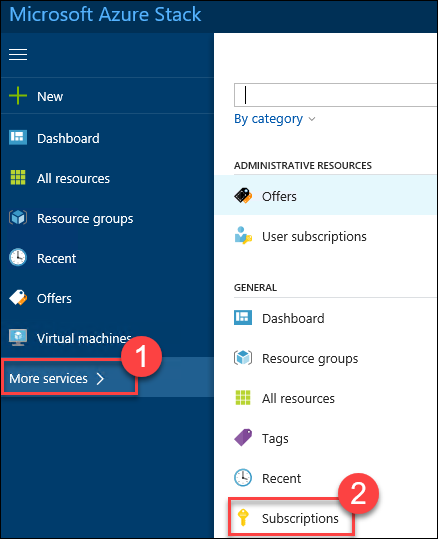

26. The Production Subscription will load, and you can click to review.

## Exercise 2: Deploy the SQL Hosting Server and DB on Azure Stack

Duration: 60 minutes

The first step to getting the website up and running is to configure the SQL Database on Azure Stack. This requires you to setup a SQL VM, configure a SQL Hosting Server and finally deploying the SQL database.

### Task 1: Create SQL Hosting Server

1.  In the Azure Stack Admin portal, click **+New**, **Data + Storage** and then **SQL HostingServer**.

    

2.  Complete the **Add a SQL Hosting Server** blade using the following inputs:

    -   SQL Server Name: **IP Address of the SQL Server VM created for the App Service Account**

    -   User Name: **sqlserveradmin**

    -   Password: **demo\@pass123**

    -   Size of Hosting Server in GB: **100**

    -   Resource group: **ContosoFinance**

    -   Location: **Local**

        

3.  Next, click **SKUs**.

    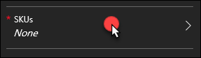

4.  Click **Create new SKU**.

    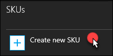

5.  Update the **Create SKU** blade with the following input and click **OK**.

    -   Name: **ContosoFinanceSQLPROD**

    -   Family: **SQLServer2017**

    -   Tier: **Standalone**

    -   Edition: **Enterprise** -- Tip in a production environment the edition should reflect the actual capabilities

        

6.  Review the Add a **SQL Hosting Server** Blade and click **Create**.

**Note:** SKUs **can take up to an hour** to be visible in the portal. Users cannot create a database until the SKU is fully created.

### Task 2: Register resource providers in the tenant subscription

1.  Launch the Azure Stack tenant portal and click More services -\> search for Subscriptions -\> click the subscription and then click Resource Providers.

2.  Click Register by each of the unregistered resource providers except Microsoft.Resources. After the RPs are registered your screen should look like this:

    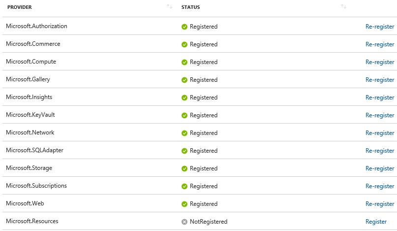

### Task 3: Deploy SQL DB on Azure Stack 

1.  In the Azure Stack Tenant portal, click **+New**, **Data + Storage** followed by **SQL Database**.

    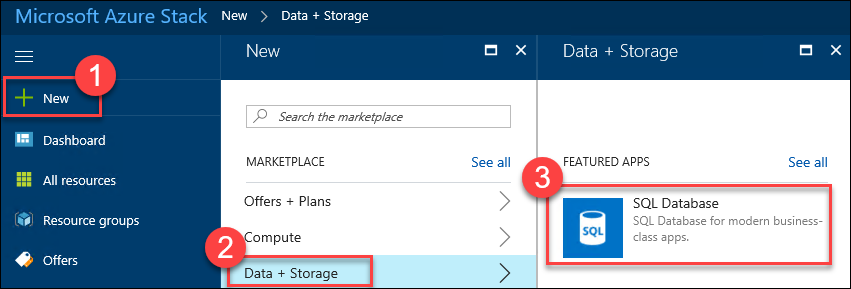

2.  Complete the **Create Database** using the following inputs.

    -   Database Name: **ContosoFinanceWebDB**

    -   Max Size in MB: **250**

    -   Resource group: **AzureStackContosoFinance**

    -   Location: **Local**

        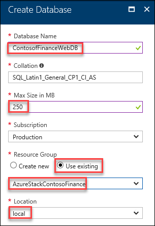

3.  Next, click **SKU**.

    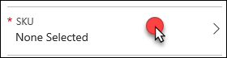

4.  Select the **ContosoFinanceSQLPROD** SKU.

    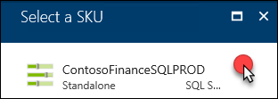

5.  Click **Login**.

    

6.  Click **Create a new login**.

    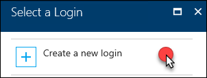

7.  Complete the **New Login** blade using these inputs and click **OK**.

    -   Database Login: **ContosoFinanceWebDB**

    -   Password: **Demo\@pass123 - Note: Upper case D**

        

8.  Review the **Create Database** blade and click **Create.**

    

9.  Once the deployment completes, use the Azure Stack User portal to locate the **ContosoFinanceWebDB** in the **AzureStackContosoFinance** resource group. Click to examine the details of the new SQL DB running in Azure Stack PaaS.

    

10. On the **ContosoFinanceWebDB**, the details highlight the connection string and copy to the clipboard. Retain this text for later in the lab by copying to notepad.

    

**Note:** If the clipboard copy does not work, you can use the following sample text for your environment. You will need to alter this text to match your configuration.

```
Data Source=X.X.X.X,1433;Initial Catalog=ContosoFinanceWebDB;User ID=ContosoFinanceWebDB;Password=demo\@pass123
```

## Exercise 3: Deploy Contoso Financial Web Application

Duration: 15-30 minutes

In this exercise, you will provision a website using the Azure Stack portal. The Web App will leverage the SQL DB running in Azure Stack. This is the front-end website that customers will see when browsing for a Mortgage or other financial services products.

### Task 1: Create the Web App

1.  From within the Azure tenant portal, click New -\> Web + Mobile -\> Web App.

2.  On the **Everything** blade, select **Web App** followed by **Create**.

    

3.  On the **Web App** blade, select **App Service plan/Location**.

    

4.  Create a new App Service plan called **ContosoFinanceWebPlan** with the **D1 Shared** pricing tier and click **OK**.

    

5.  On the **Web App** blade, specify the following configuration, and click **Create.**

    -   App Name: **Specify a unique and valid URL (until the green check mark appears)**

    -   Resource group: **ContosoFinanceWeb**

        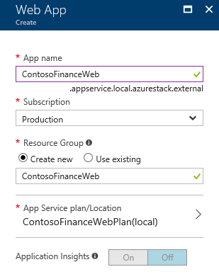

### Task 2: Provision an Azure Storage Account

1.  In the Azure Tenant portal, click **+New, Data + Storage,** and **Storage account**.

    

2.  On the **Create storage account** blade, specify the following configuration options:

    -   Name: **unique value for the storage account (ensure the green check mark appears)**

    -   Resource Group: **AzureGlobalContosoFinance**

        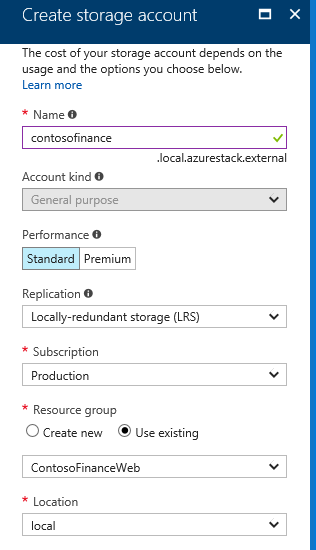

3.  Click **Create**.

    

4.  After the storage account has completed provisioning, open the storage account by clicking **More services,** **Storage accounts**, and storage account name.

5.  On the **Storage** account blade, scroll down, and select the **Access keys** option.

    

6.  On the **Access keys** blade, click the copy button by **key1** to copy the **Key**. Put the value in notepad for later reference.

    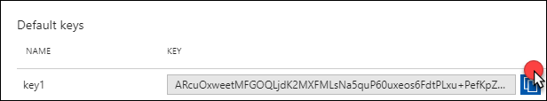

    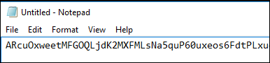

7.  On the **Access keys** blade, click the copy button by **key1** on the **Connection string**. Put the value in notepad for later reference.

    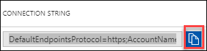

    

**Note:** If the copy to clipboard button does not work, you may need to highlight the key and copy by right-clicking. Some versions of Internet Explorer have issues with this functionality.

### Task 3: Update the configuration strings

1.  On the left pane of the **contosofinanceweb** Web App, click on **Application settings**.

    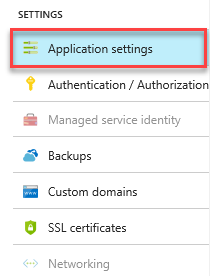

2.  Scroll down and locate the **App settings** section.

    

3.  Add a new **App setting** with the following values:

    -   Key: **AzureQueueConnectionString**

    -   Value: **enter the Connection String for the Storage Account that was just created**

        

4.  Move to your Notepad with the SQL Server Connection string copied from Azure Stack. Update the following items in the string:

    -   Password: **Demo\@pass123**

5.  Locate **Connection Strings** below App settings in the Azure tenant portal, add a new **Connection String** with the following values:

    -   Name: **ContosoFinance **

    -   Value: **enter the Connection String for the SQL Database in Azure Stack you just updated**

    -   Type: **SQL Database**

        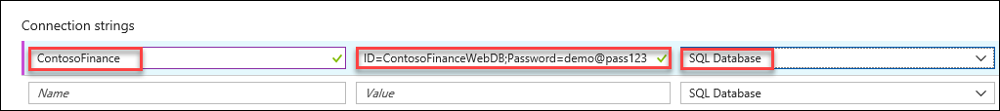

6.  Click **Save**.

### Task 4: Publish the Contoso Financial Web Application

1.  From within the web app blade, click on **Deployment Options**.

    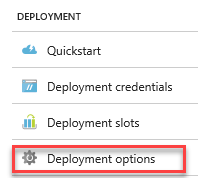

2.  Click **Choose Source**, and then **External Repository**.

    

3.  Paste <https://github.com/opsgility/contosofinanceweb> as the **Repository URL** and click **OK**.

4.  Click on the Deployment options button and monitor until the application is deployed.

5.  Click the Overview tab, and then click the URL. You should see the Contoso Finance web app.

    

**Note:** You may get an error about CORS. This can be ignored, as it will be configured later in the lab.

6.  Validate the website by clicking the **Products** link on the menu. If the products return, the connection to the database is successful.

    

## Exercise 4: Deploy the customer offers Web API

Duration: 15-30 minutes

In this exercise, you will provision an Azure API App using the Azure Stack portal. This API application is part of the front-end Web Applications and makes recommendations to the user on products the company wishes to highlight. The API App will leverage the SQL Database deployed previously.

### Task 1: Provision the offers Web API App

1.  Using the Azure Stack Tenant portal, click **+New**, **Web + Mobile**, and click **API App**.

    

2.  Click on **Create**.

3.  On the new **API App** blade, **specify a unique name** for the App Name, and ensure the previously used Resource Group and App Service Plan is selected.

4.  After the values are accepted click **Create**.

5.  On the **App Service** blade, scroll down, and click on **CORS** within the API section of the left pane.

    

6.  In the **ALLOWED ORIGINS** text box specify \* and click **Save**.

    

7.  On the **App Service** blade for the Offers API, click on **Application settings**

    

8.  Scroll down, and locate the **Connection strings** section.

    

9.  Locate **Connection Strings** below App settings in the Azure global portal Add a new **Connection String** with the following values:

    -   Name: **ContosoFinance (must match exactly -- case sensitive)**

    -   Value: **enter the Connection String for the SQL Database in Azure Stack you just updated**

    -   Type: **SQL Database**

        

10. Click **Save**.

### Task 2: Deploy the Contoso.Apps.Financial.Offers project

1.  From within the API app blade, click on **Deployment options**.

    

2.  Click **Choose Source**, and then **External Repository**.

    

3.  Paste <https://github.com/opsgility/contosofinanceoffers> as the **Repository URL** and click **OK**.

4.  Click on the Deployment options button and monitor until the application is deployed.

5.  On the **Overview** tab, copy the URL for the web app to the clipboard.

### Task 3: Update the Application Settings of the Web App with the API URL

1.  Open the ContosoFinanceWeb application in the Azure Stack Tenant portal and click on Application settings.\
    

2.  Scroll down and locate the **App settings** section.

    

3.  Add a new **App Setting** with the following values:

    -   Key: **offersAPIUrl**

    -   Value: enter the **HTTPS** URL for the Offers API App with **/api/get** appended to the end. Example: <https://contosofinanceapi.azurewebsites.net/api/get>

        

4.  Click on **Save**.

**Note:** Ensure the API URL is using **SSL** (https://), or you will see a CORS errors when loading the webpage.

5.  Connect to the URL of the **contosofinanceweb** Web App.

    

6.  On the homepage, you should see the latest offers populated from the offers API.

    

## Exercise 5: Automating backend processes with Azure functions 

Duration: 15-30 minutes

Contoso wants to automate the process of generating applications in PDF format and using Azure Functions. In this exercise, you will provision a Function App using the Azure Stack portal. This Function App will watch the Azure Storage Queue for a message that the web application has submitted, process the application creating a PDF and storing it in Azure Blob Storage.

### Task 1: Create an Azure function to generate PDF receipts

1.  From your Azure Stack Host, navigate to the following repository: <https://github.com/opsgility/contosofinancefunction> and click **Clone or download**, and then **Download ZIP**. Download to the **C:\\HOL** folder. After the file is downloaded, right click and extract to **C:\\HOL**.

    

2.  From the Tenant portal, click **+New**, **Web + Mobile**, and then click **Function App**.

    

3.  Complete the **Create Function App** blade using the following inputs:

    -   App name: **specify a unique name**

    -   [Resource Group](https://docs.microsoft.com/en-us/azure/azure-resource-manager/resource-group-overview): **ContosoFinanceWeb**

    -   Hosting Plan: **App Service Plan**

    -   App Service plan/Location: **ContosoFinanceWeb**

    -   Storage Account: **select your storage account**

        

4.  Click **Create**.

5.  Using the Azure Stack portal, open the Function App you just created, click **Functions** and then **New Function**.

    

6.  Locate the **Queue trigger** box and click **C\#**.

    

7.  Complete the **New Function** blade using the following inputs and click **Create**.

    -   Language: **C\#**

    -   Name: **QueueTriggerGeneratePDF**

    -   Queue name: **receiptgenerator (must be this exact text)**

        

8.  Expand the View files area on the right of the code window, and click **Upload**.

    

9.  Upload the following files from your LABVM in the **C:\\HOL\\contosofinancefunction-master** folder:

    -   CreatePdfReport.csx

    -   Project.json

    -   run.csx

    -   StorageMethods.csx

    -   ViewModels.csx

10. Click on **run.csx** to refresh the code editor.

    

11. Select the **name of your function app followed by** **Application settings.**

    

12. Scroll down to the **Application settings** and click **+Add new setting** to add a storage connection. This storage account will be used to write the PDFs to blob storage.

    -   Name: **contosofinancestorage (must be this name exactly)**

    -   Value: **paste the connection string for the storage account created earlier in the lab**

13. Locate **Connection Strings** below Application settings in the Azure tenant portal, and click **+Add a new** **Connection String** with the following values:

    -   Name: **ContosoFinance (must match exactly -- case sensitive)**

    -   Value: **enter the Connection String for the SQL Database**

    -   Type: **SQL Azure**

        

14. Scroll back up to the top of the blade and click **Save.**

    

## Exercise 6: Deploy Contoso Finance Admin website

Duration: 15-30 minutes

In this exercise, you will provision the admin website to be used by employees to review applications submitted.

### Task 1: Provision the Contoso Finance Admin Web App

1.  In the Azure tenant portal, click **New**, **Web + mobile**, and select **Web App**.

    

2.  Specify a **unique URL** for the Web App, ensure the **same App Service Plan** as well as the **ContosoFinanceWeb** resource group you have used throughout the lab are selected.

    

3.  After the values are accepted, click **Create**.

4.  Navigate to the **App Service** blade for the Admin app recently provisioned.

    

5.  On the **App Service** blade, click on **Application settings** in the left pane.

    

6.  Scroll down and locate the **Connection strings** section.

    

7.  Locate **Connection Strings** below App settings in the Azure tenant portal add a new **Connection String** with the following values:

    -   Name: **ContosoFinance**

    -   Value: **enter the Connection String for the SQL Database in Azure Stack you just updated**

    -   Type: **SQL Database**

        

8.  Click **Save**.

### Task 2: Deploy the call center admin Web App from Visual Studio

1.  From within the web app blade, click on **Deployment options**.

    

2.  Click **Choose Source**, and then **External Repository**.

    

3.  Paste <https://github.com/opsgility/contosofinanceadmin> as the **Repository URL** and click **OK**.

4.  Click on the Deployment options button and monitor until the application is deployed.

5.  On the **Overview** tab, copy the URL for the web app to the clipboard.

6.  Connect to the **contosofinanceadmin** portal to see the list of applications that have been completed.

    

Note: In production this application would be secured using Azure AD for authentication purposes.

7.  Since the application is fully deployed, you will want to see it work end to end. Open the URL for the contosofinanceweb Web App. The application will load in the browser.

    

    

8.  Notice how the API application loaded the Today's Offers area. Click through to one of the products and add it to your cart.

    

9.  Click **Apply**.

    

10. Complete the Application and click **Continue** followed by **Complete Application** on the confirmation screen.

    

    

11. Now, to act as an employee, open the Admin application to see the submitted applications. Click **Details** on one of the applications.

    

    

12. Notice the details of the application. This data is stored in SQL DB running in PaaS on Azure Stack. Click **Download application to view a sample PDF.**

    

## After the hands-on lab 

Duration: 10 minutes

In this final task you will clean up the Azure Resources that you have create for the hands-on lab. This task is optional.

1.  If provisioned using the Azure Stack Developer Kit in an Azure VM, delete the resource group your Azure Stack Host VM is running in.

2.  If running on your own Developer Kit, delete all the resource groups from the Azure Stack portal that you created during the execution of this lab.