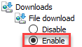
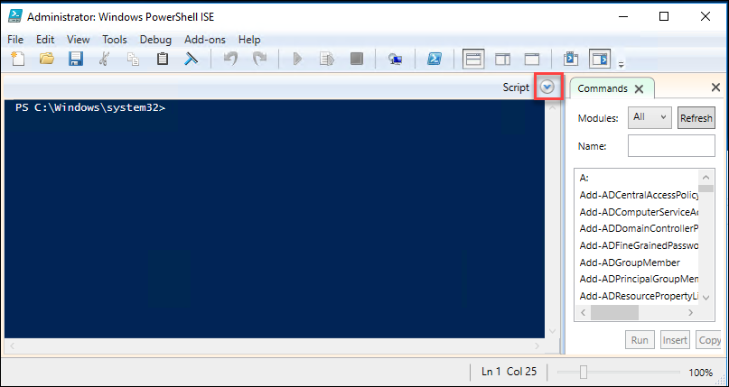
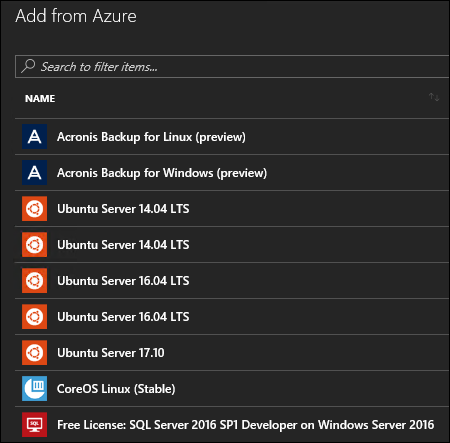
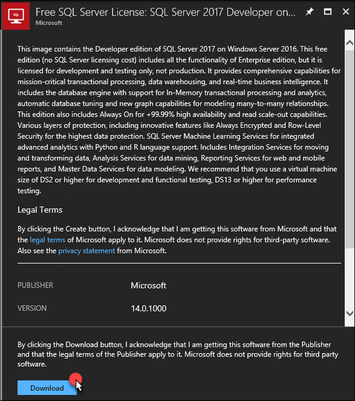
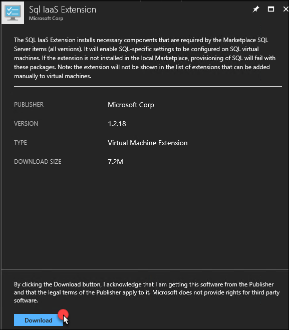

<div class="MCWHeader1">
Azure Stack
</div>

<div class="MCWHeader2">
Before the hands-on lab setup guide
</div>

<div class="MCWHeader3">
September 2018
</div>


Information in this document, including URL and other Internet Web site references, is subject to change without notice. Unless otherwise noted, the example companies, organizations, products, domain names, e-mail addresses, logos, people, places, and events depicted herein are fictitious, and no association with any real company, organization, product, domain name, e-mail address, logo, person, place or event is intended or should be inferred. Complying with all applicable copyright laws is the responsibility of the user. Without limiting the rights under copyright, no part of this document may be reproduced, stored in or introduced into a retrieval system, or transmitted in any form or by any means (electronic, mechanical, photocopying, recording, or otherwise), or for any purpose, without the express written permission of Microsoft Corporation.

Microsoft may have patents, patent applications, trademarks, copyrights, or other intellectual property rights covering subject matter in this document. Except as expressly provided in any written license agreement from Microsoft, the furnishing of this document does not give you any license to these patents, trademarks, copyrights, or other intellectual property.

The names of manufacturers, products, or URLs are provided for informational purposes only and Microsoft makes no representations and warranties, either expressed, implied, or statutory, regarding these manufacturers or the use of the products with any Microsoft technologies. The inclusion of a manufacturer or product does not imply endorsement of Microsoft of the manufacturer or product. Links may be provided to third party sites. Such sites are not under the control of Microsoft and Microsoft is not responsible for the contents of any linked site or any link contained in a linked site, or any changes or updates to such sites. Microsoft is not responsible for webcasting or any other form of transmission received from any linked site. Microsoft is providing these links to you only as a convenience, and the inclusion of any link does not imply endorsement of Microsoft of the site or the products contained therein.

© 2018 Microsoft Corporation. All rights reserved.

Microsoft and the trademarks listed at <https://www.microsoft.com/en-us/legal/intellectualproperty/Trademarks/Usage/General.aspx> are trademarks of the Microsoft group of companies. All other trademarks are property of their respective owners.# Azure Stack setup

**Contents**

<!-- TOC -->

- [Azure Stack before the hands-on lab setup guide](#azure-stack-before-the-hands-on-lab-setup-guide)
    - [Requirements](#requirements)
    - [Before the hands-on lab](#before-the-hands-on-lab)
        - [Task 1: Create a virtual machine to execute the lab](#task-1-create-a-virtual-machine-to-execute-the-lab)
        - [Task 2: Install the Azure Stack Developer Kit](#task-2-install-the-azure-stack-developer-kit)
        - [Task 3: Install PowerShell for Azure Stack](#task-3-install-powershell-for-azure-stack)
        - [Task 4: Download the Latest Azure Stack Tools](#task-4-download-the-latest-azure-stack-tools)
        - [Task 5: Register Azure Stack with Azure AD](#task-5-register-azure-stack-with-azure-ad)
        - [Task 6: Download VM Images to Azure Stack Marketplace](#task-6-download-vm-images-to-azure-stack-marketplace)

<!-- /TOC -->

# Azure Stack before the hands-on lab setup guide 

## Requirements

-   Microsoft Azure subscription 

## Before the hands-on lab

Duration: 6-7 hours

To execute this lab, you will have two options: you can use your own Azure Stack Development Kit that is already installed, or you will need to follow the instructions below to setup your own in Microsoft Azure using nested virtual machines.

For help with installation of the Azure Stack Development Kit, review the following article: <https://azure.microsoft.com/en-us/overview/azure-stack/development-kit>.

### Task 1: Create a virtual machine to execute the lab

1.  Launch a browser, and navigate to <https://github.com/opsgility/cw-azure-stack> and click the **Deploy to Azure** button.

2.  Specify a resource group name **AzureStack** and deploy the template.

    > **Note:** Please wait for the virtual machine to be provisioned prior to moving to the next step.

3.  After the VM is provisioned, **connect** to establish a new Remote Desktop Session.

4.  Depending on your Remote Desktop Protocol Client and browser configuration, you will either be prompted to open an RDP file, or you will need to download it and then open it separately to connect.

5.  Log in with the credentials specified during creation:

    -   User: **administrator**

    -   Password: **demo\@pass123**

6.  You will be presented with a Remote Desktop Connection warning because of a certificate trust issue. Click **Yes** to continue with the connection.

    

7.  When logging on for the first time, you will see a prompt on the right asking about network discovery. Click **No**.

    

8.  Notice that Server Manager opens by default. On the left, click **Local Server**.

    

9.  On the right side of the pane, click **On** by **IE Enhanced Security Configuration**.

10. Change to **Off** for Administrators and click **OK**.

    

11. Launch Internet Explorer, and right click at the top of the browser and check Menu bar. Then open Tools -\> Internet Options -\> Security -\> Custom Level. Change File download to **Enable**.

    

### Task 2: Install the Azure Stack Developer Kit

1.  Launch an elevated PowerShell console and execute the following commands:

    ```powershell
    cd C:\AzureStackOnAzureVM

    .\Install-ASDK.ps1
    ```

    When prompted enter:

    -   Password for administrator: **demo\@pass123**

    -   Enter Azure AD User: Specify your Azure subscription user account.

    -   Select ASK Version **1808** and press **C** to continue.

2.  It will take up to 6 hours to successfully install the Azure Stack developer kit.

3.  After the installation reboots the virtual machine, login to the AzSHost-1 virtual machine using RDP to monitor the installation progress. You will need to use the account:

    -   Username: **azurestack.local\\azurestackadmin**

    -   Password: **\[your Azure Stack password\]**

4.  Once connected open Server Manager. On the left, click **Local Server**.  

    > **Note:** Wait until installation is complete.

### Task 3: Install PowerShell for Azure Stack

1.  Using your LABVM connect to your Azure Stack Host using RDP. You will need to use the account:

    -   Username: **azurestack.local\\azurestackadmin**

    -   Password: **\[your Azure Stack password\]**

2.  Open PowerShell ISE as an administrator. You will need to **right-click the link** on the start menu, click **More**, and **Run as administrator**.

    

3.  Click **Yes** when prompted.

    

4.  On the PowerShell ISE window, open the script pane by clicking the **\>** mark next to the word **Script**.

    

5.  Execute the following command to trust the PSGallery repository:

    ```powershell
    Register-PSRepository -Default
    Set-PSRepository -Name "PSGallery" -InstallationPolicy Trusted
    ```
    
    > **Note**: If you are using the VM from the suggested template, the repository is already registered and you will receive an error that you can ignore.

6.  Next, execute the following command to remove any previous versions of Azure PowerShell:

    ```powershell
    Get-Module -ListAvailable | where-Object {$_.Name -like "Azure*"} | Uninstall-Module
    ```

    > **Note**: If you see any errors you can safely ignore them.

7.  Remove any folders in the following folder that begin with Azure (if any).

    ```
    C:\Users\AzureStackAdmin\Documents\WindowsPowerShell\Modules
    ```

8.  Finally, execute the following command to install the Azure Stack PowerShell cmdlets:

    ```powershell
    # Install the AzureRM.Bootstrapper module. Select Yes when prompted to install NuGet

    Install-Module -Name AzureRm.BootStrapper

    # Install and import the API Version Profile required by Azure Stack into the current PowerShell session.

    Use-AzureRmProfile -Profile 2017-03-09-profile -Force

    Install-Module -Name AzureStack -RequiredVersion 1.4
    ```

### Task 4: Download the Latest Azure Stack Tools

1.  Using the previous elevated PowerShell console execute the following commands to download and extract the Azure Stack tools from GitHub.

    ```powershell
    # Change directory to the root directory.

    cd \

    # Download the tools archive.

    [Net.ServicePointManager]::SecurityProtocol = [Net.SecurityProtocolType]::Tls12

    invoke-webrequest https://github.com/Azure/AzureStack-Tools/archive/master.zip -OutFile master.zip

    # Expand the downloaded files.

    expand-archive master.zip -DestinationPath .  -Force

    # Change to the tools directory.

    cd AzureStack-Tools-master
    ```
    
### Task 5: Register Azure Stack with Azure AD

In this task, execute all the commands from an elevated PowerShell console on the Azure Stack host.

1.  CD to the registration folder of the AzureStack-Tools-master folder.

    ```powershell
    CD C:\AzureStack-Tools-master\Registration
    ```

2.  Execute the following command to login:

    ```powershell
    Add-AzureRmAccount -EnvironmentName AzureCloud
    ```

3.  Next, execute the following command to view the Azure subscriptions available:

    ```powershell
    Get-AzureRmSubscription
    ```

4.  Next, execute the following command and specify the subscription ID you want to register Azure Stack to.

    ```powershell
    Select-AzureRmSubscription -SubscriptionId [your subscription id here]
    ```

5.  Register the Azure Stack resource provider with your subscription by executing the following command:

    ```powershell
    Register-AzureRmResourceProvider -ProviderNamespace Microsoft.AzureStack
    ```

6.  Next, execute the following commands to register your Azure Stack installation. When prompted, login with the **azurestack.local\\azurestackadmin** account using **demo@pass123** for the password.

    ```powershell
    Import-Module .\RegisterWithAzure.psm1

    $AzureContext = Get-AzureRmContext

    $CloudAdminCred = Get-Credential

    Set-AzsRegistration `
        -PrivilegedEndpointCredential $CloudAdminCred `
        -PrivilegedEndpoint Azs-ERCS01 `
        -BillingModel Development

    ```

7.  Open the Azure portal and navigate to your resource groups. Notice a new resource group named **azurestack** was created. If you open this resource group, you will see the registration resource.

    

8.  To verify the registration was successful on the Azure Stack Host, navigate to the Azure Stack admin portal at <http://adminportal.local.azurestack.external>. Sign in using your Azure AD credentials used during the Azure Stack Development Kit installation.

### Task 6: Download VM Images to Azure Stack Marketplace

In this task, you will download the following images and artifacts which are needed for the resource providers installed later:

   -   SQL Server 2017 on Windows Server 2016 Image

   -   SQL IaaS Extension

   -   Windows Server 2016 -- Server Core Pay for Use

   -   Windows Server 2016 Data Center Pay for Use

1.  From within the Azure Stack Admin portal, click **Marketplace management**.

    

2.  You should see the following message: **You have no items downloaded to your Azure Stack marketplace yet.** Click **"Add from Azure"** to add items.

    

3.  Click **+Add** from Azure and if you see the Marketplace Items, you have registered successfully.

    

    

4.  From the Marketplace management area of the Azure Stack Admin portal, select the **Developer edition of SQL Server 2017 on Windows Server 2016**.

    

5.  Click **Download**.

    

6.  A notification will pop-up notifying you the product is being downloaded to Azure Stack.

    

7.  In the Add from Azure search bar, type SQL IaaS, and press enter. The SQL IaaS Extension will appear in the search results. Click its name.

    

8.  When the SQL IaaS Extension appears, click **Download**.

    

9.  A notification will pop-up notifying you the product is being downloaded to Azure Stack.

    

10. In the Add from Azure search bar, type **Windows Server**, and press **enter**.

-   Download **both** of the following images:

    -   Windows Server 2016 Datacenter - Pay as you use.

    -   Windows Server 2016 Datacenter - Server Core - Pay as you use.

8.  Once the products are downloaded, you will receive a notification.

    

    > **Note:** These downloads will take some time depending upon your Azure Stack connectivity. Wait until they complete before proceeding to the next task.
    
    You should follow all steps provided *before* performing the Hands-on lab.
