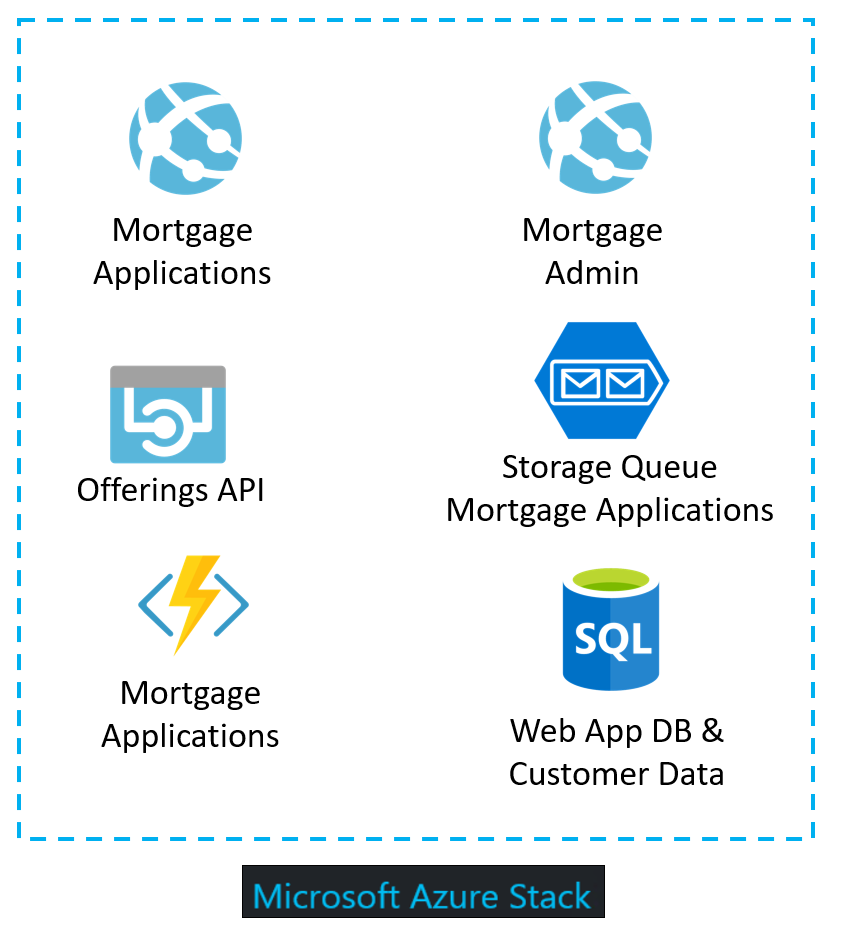



Azure Stack

Hands-on lab unguided

June 2018

Information in this document, including URL and other Internet Web site references, is subject to change without notice. Unless otherwise noted, the example companies, organizations, products, domain names, e-mail addresses, logos, people, places, and events depicted herein are fictitious, and no association with any real company, organization, product, domain name, e-mail address, logo, person, place or event is intended or should be inferred. Complying with all applicable copyright laws is the responsibility of the user. Without limiting the rights under copyright, no part of this document may be reproduced, stored in or introduced into a retrieval system, or transmitted in any form or by any means (electronic, mechanical, photocopying, recording, or otherwise), or for any purpose, without the express written permission of Microsoft Corporation.

Microsoft may have patents, patent applications, trademarks, copyrights, or other intellectual property rights covering subject matter in this document. Except as expressly provided in any written license agreement from Microsoft, the furnishing of this document does not give you any license to these patents, trademarks, copyrights, or other intellectual property.

The names of manufacturers, products, or URLs are provided for informational purposes only and Microsoft makes no representations and warranties, either expressed, implied, or statutory, regarding these manufacturers or the use of the products with any Microsoft technologies. The inclusion of a manufacturer or product does not imply endorsement of Microsoft of the manufacturer or product. Links may be provided to third party sites. Such sites are not under the control of Microsoft and Microsoft is not responsible for the contents of any linked site or any link contained in a linked site, or any changes or updates to such sites. Microsoft is not responsible for webcasting or any other form of transmission received from any linked site. Microsoft is providing these links to you only as a convenience, and the inclusion of any link does not imply endorsement of Microsoft of the site or the products contained therein.

© 2018 Microsoft Corporation. All rights reserved.

Microsoft and the trademarks listed at https://www.microsoft.com/en-us/legal/intellectualproperty/Trademarks/Usage/General.aspx are trademarks of the Microsoft group of companies. All other trademarks are property of their respective owners.

**Contents**

<!-- TOC -->

- [Azure Stack hands-on lab unguided](#azure-stack-hands-on-lab-unguided)
    - [Abstract and learning objectives](#abstract-and-learning-objectives)
    - [Overview](#overview)
    - [Solution architecture](#solution-architecture)
    - [Help references](#help-references)
    - [Exercise 1: Configure Azure Stack](#exercise-1-configure-azure-stack)
        - [Task 1: Deploy the Azure Stack App Service Resource Provider](#task-1-deploy-the-azure-stack-app-service-resource-provider)
            - [Tasks to complete](#tasks-to-complete)
            - [Exit criteria](#exit-criteria)
        - [Task 2: Deploy the Azure Stack SQL DB Resource Provider](#task-2-deploy-the-azure-stack-sql-db-resource-provider)
            - [Tasks to complete](#tasks-to-complete-1)
            - [Exit criteria](#exit-criteria-1)
        - [Task 3: Create Azure Stack Deployment Taxonomy for Tenets](#task-3-create-azure-stack-deployment-taxonomy-for-tenets)
            - [Tasks to complete](#tasks-to-complete-2)
            - [Exit criteria](#exit-criteria-2)
    - [Exercise 2: Deploy the SQL Hosting Server and DB on Azure Stack](#exercise-2-deploy-the-sql-hosting-server-and-db-on-azure-stack)
        - [Task 1: Create SQL Hosting Server](#task-1-create-sql-hosting-server)
            - [Tasks to complete](#tasks-to-complete-3)
            - [Exit criteria](#exit-criteria-3)
        - [Task 2: Register resource providers in the tenant subscription](#task-2-register-resource-providers-in-the-tenant-subscription)
            - [Tasks to complete](#tasks-to-complete-4)
            - [Exit criteria](#exit-criteria-4)
        - [Task 3: Deploy SQL DB on Azure Stack](#task-3-deploy-sql-db-on-azure-stack)
            - [Tasks to complete](#tasks-to-complete-5)
            - [Exit criteria](#exit-criteria-5)
    - [Exercise 3: Deploy Contoso Financial Web Application](#exercise-3-deploy-contoso-financial-web-application)
        - [Task 1: Create the Web App](#task-1-create-the-web-app)
            - [Tasks to complete](#tasks-to-complete-6)
            - [Exit criteria](#exit-criteria-6)
        - [Task 2: Provision an Azure Storage Account](#task-2-provision-an-azure-storage-account)
            - [Tasks to complete](#tasks-to-complete-7)
            - [Exit criteria](#exit-criteria-7)
        - [Task 3: Update the configuration strings](#task-3-update-the-configuration-strings)
            - [Tasks to complete](#tasks-to-complete-8)
            - [Exit criteria](#exit-criteria-8)
        - [Task 4: Publish the Contoso Financial Web Application](#task-4-publish-the-contoso-financial-web-application)
            - [Tasks to complete](#tasks-to-complete-9)
            - [Exit criteria](#exit-criteria-9)
    - [Exercise 4: Deploy the customer offers Web API](#exercise-4-deploy-the-customer-offers-web-api)
        - [Task 1: Provision the offers Web API App](#task-1-provision-the-offers-web-api-app)
            - [Tasks to complete](#tasks-to-complete-10)
            - [Exit criteria](#exit-criteria-10)
        - [Task 2: Deploy the Contoso.Apps.Financial.Offers project](#task-2-deploy-the-contosoappsfinancialoffers-project)
            - [Tasks to complete](#tasks-to-complete-11)
            - [Exit criteria](#exit-criteria-11)
        - [Task 3: Update the Configuration Settings with the API URL](#task-3-update-the-configuration-settings-with-the-api-url)
            - [Tasks to complete](#tasks-to-complete-12)
            - [Exit criteria](#exit-criteria-12)
    - [Exercise 5: Automating backend processes with Azure functions](#exercise-5-automating-backend-processes-with-azure-functions)
        - [Task 1: Create an Azure function to generate PDF receipts](#task-1-create-an-azure-function-to-generate-pdf-receipts)
            - [Tasks to complete](#tasks-to-complete-13)
            - [Exit criteria](#exit-criteria-13)
    - [Exercise 6: Deploy Contoso Finance Admin website](#exercise-6-deploy-contoso-finance-admin-website)
        - [Task 1: Provision the Contoso Finance Admin Web App](#task-1-provision-the-contoso-finance-admin-web-app)
            - [Tasks to complete](#tasks-to-complete-14)
            - [Exit criteria](#exit-criteria-14)
        - [Task 2: Deploy the call center admin Web App from Visual Studio](#task-2-deploy-the-call-center-admin-web-app-from-visual-studio)
            - [Tasks to complete](#tasks-to-complete-15)
            - [Exit criteria](#exit-criteria-15)
    - [After the hands-on lab](#after-the-hands-on-lab)

<!-- /TOC -->

# Azure Stack hands-on lab unguided 

## Abstract and learning objectives 

In this hands-on lab, you will deploy the Azure Stack Development Kit and deploy the SQL Database and Azure App Service resource providers, as well as download several virtual machine images from the Azure Stack Marketplace. From there, you will implement a full taxonomy in Azure Stack consisting of a region, subscription, plan, offer, and quotas. After Azure Stack is configured, you will then deploy Azure SQL Database, Web and API apps and then deploy the Contoso application.

At the end of this hands-on lab, you will be better able to deploy and manage solutions running on Azure Stack.

## Overview

Contoso Finance is one of the largest banks in the United States with a significant amount of their revenue coming from their residential mortgage business. As part of Contoso's shift to a cloud first strategy they planning to migrate their loan web applications to a hybrid cloud solution. During the planning stages, Contoso realized they would not be able to retain their customer data in US based Azure regions due to corporate compliance policies and regulatory issues. They have selected Azure Stack as the deployment method to take advantage of Azure technologies while still maintaining compliance.

## Solution architecture

## Help references
|    |            |
|----------|:-------------:|
| **Description** | **Links** |
| Azure Stack overview  | <https://azure.microsoft.com/en-us/overview/azure-stack/> |
| Azure Stack use cases | <https://azure.microsoft.com/en-us/overview/azure-stack/use-cases/> |
| Azure Stack features | <https://docs.microsoft.com/en-us/azure/azure-stack/azure-stack-key-features> |
| Azure Stack planning considerations | <https://docs.microsoft.com/en-us/azure/azure-stack/azure-stack-planning-considerations> |
| Azure Stack documentation | <https://docs.microsoft.com/en-us/azure/azure-stack/> |
| Azure Stack Operator documentation | <https://docs.microsoft.com/en-us/azure/azure-stack/> |
| Azure Stack networking | <https://docs.microsoft.com/en-us/azure/azure-stack/user/azure-stack-network-overview/> |
| Azure Stack to Azure Global VPN | <https://docs.microsoft.com/en-us/azure/azure-stack/azure-stack-connect-vpn> |
| Register Azure Stack with your subscription | <https://docs.microsoft.com/en-us/azure/azure-stack/azure-stack-register> |
| Deploy the Azure Stack App Service resource provider | <https://docs.microsoft.com/en-us/azure/azure-stack/azure-stack-app-service-deploy> |
| Deploy the Azure Stack SQL resource provider | <https://docs.microsoft.com/en-us/azure/azure-stack/azure-stack-sql-resource-provider-deploy#deploy-the-resource-provider> |
| Deploy apps to Azure and Azure Stack | <https://docs.microsoft.com/en-us/azure/azure-stack/user/azure-stack-solution-pipeline> |
| White paper | <https://azure.microsoft.com/en-us/resources/azure-stack-an-extension-of-azure/> |
| PowerShell for Azure Stack | <https://docs.microsoft.com/en-us/azure/azure-stack/user/azure-stack-powershell-install> |
| Azure Stack marketplace | <https://docs.microsoft.com/en-us/azure/azure-stack/azure-stack-marketplace-azure-items> |

## Exercise 1: Configure Azure Stack

Duration: 2-3 hours

In this exercise, you will configure the Azure Stack environment for the lab. You will install the resource providers for Azure SQL Database and Azure App Service, from there you will configure the taxonomy for the Azure Stack hands-on lab.

### Task 1: Deploy the Azure Stack App Service Resource Provider

#### Tasks to complete

-   Deploy a Windows Server File Server in Azure Stack using the Azure QuickStart template **appservice-fileservice-standalone**

-   Deploy a SQL Server in Azure Stack using the SQL Server image deployed in the Before the hands-on lab section

-   Follow the steps in the following documentation <https://docs.microsoft.com/en-us/azure/azure-stack/azure-stack-app-service-deploy> to install the Azure App Service Resource provider

#### Exit criteria

-   The Azure App Service resource provider should be installed. You should be able to create a new Azure Web App from your Azure Stack deployment

### Task 2: Deploy the Azure Stack SQL DB Resource Provider

#### Tasks to complete

-   Follow the steps in the following documentation <https://docs.microsoft.com/en-us/azure/azure-stack/azure-stack-sql-resource-provider-deploy#deploy-the-resource-provider> to install the Azure SQL Database Resource Provider

#### Exit criteria

-   In the Azure Stack admin portal, SQL Database and SQL HostingServer should now appear as options beneath the Data + Storage section when creating a new resource

### Task 3: Create Azure Stack Deployment Taxonomy for Tenets

#### Tasks to complete

-   Create a new Azure Stack Plan with the following services supported:

    -   Microsoft.Compute

    -   Microsoft.KeyVault

    -   Microsoft.Network

    -   Microsoft.SQLAdapter

    -   Microsoft.Storage

    -   Microsoft.Subscriptions

-   Specify default quota for all services except SQL. Use the following settings instead:

    -   Quota Name (no spaces allowed): **SQLQuota**

    -   Maximum size of all databases (GB): **50**

    -   Maximum number of databases: **20**

-   Create a new offer from the plan and set the offer to be publicly visible

-   Login to the tenant portal and create a new Azure Stack subscription using the new offer

#### Exit criteria

-   You should have a new plan and offer with the custom Azure SQL Database quota

-   You should be able to login to the tenant portal and create a resource using the new subscription

## Exercise 2: Deploy the SQL Hosting Server and DB on Azure Stack

Duration: 60 minutes

The first step to getting the website up and running is to configure the SQL Database on Azure Stack. This requires you to setup a SQL VM, configure a SQL Hosting Server and finally deploying the SQL database.

### Task 1: Create SQL Hosting Server

#### Tasks to complete

-   Create a new SQL Hosting Server in the Azure Stack Admin portal. During creation, set the size of the new hosting server in GB to 100.

#### Exit criteria

-   You should have a new SQL Hosting Server resource provisioned in the Azure Stack Admin portal

### Task 2: Register resource providers in the tenant subscription

#### Tasks to complete

-   In the Azure Stack Tenant portal, navigate to Subscriptions -\> Resource Providers and register all resource providers not currently registered

#### Exit criteria

-   All of your resource providers should show registered

### Task 3: Deploy SQL DB on Azure Stack 

#### Tasks to complete

-   Deploy a new Azure SQL Database instance in the Azure Tenant portal using the following configuration:

    -   Database Name: **ContosoFinanceWebDB**

    -   Max Size in MB: **250**

    -   Resource group: **AzureStackContosoFinance**

    -   Location: **Local**

-   Copy the connection string for later reference

#### Exit criteria

-   A deployed SQL Database in the Azure Stack Tenant portal and a copy to the connection string

## Exercise 3: Deploy Contoso Financial Web Application

Duration: 15-30 minutes

In this exercise, you will provision a website using the Azure Stack portal. The Web App will leverage the SQL DB running in Azure Stack. This is the front-end website that customers will see when browsing for a Mortgage or other financial services products.

### Task 1: Create the Web App

#### Tasks to complete

-   Create a new Azure Web App in the Azure Stack Tenant portal using the following configuration:

    -   App Name: **Specify a unique and valid URL (until the green check mark appears)**

    -   Resource group: **ContosoFinanceWeb**

#### Exit criteria

-   A functioning web app deployed in the Azure Stack Tenant portal

### Task 2: Provision an Azure Storage Account

#### Tasks to complete

-   Create a new Azure Storage Account in the Azure Stack Tenant portal using the following configuration:

    -   Name: **unique value for the storage account (ensure the green check mark appears)**

    -   Resource Group: **AzureGlobalContosoFinance** 

#### Exit criteria

-   A storage account deployed in the Azure Stack Tenant Portal

### Task 3: Update the configuration strings

#### Tasks to complete

-   Add a new **App setting** with the following values:

    -   Key: **AzureQueueConnectionString**

    -   Value: **enter the Connection String for the Storage Account that was just created**

-   Locate **Connection Strings** below App settings in the Azure Global Add a new **Connection String** with the following values:

    -   Name: **ContosoFinance**

    -   Value: **enter the Connection String for the SQL Database in Azure Stack you just updated**

    -   Type: **SQL Database**

#### Exit criteria

-   The application settings for the web app should be configured to reference the newly created storage account and Azure SQL Database

### Task 4: Publish the Contoso Financial Web Application

#### Tasks to complete

-   Deploy the web app from the following GitHub repository: <https://github.com/opsgility/contosofinanceweb>

#### Exit criteria

-   Navigate to the URL of your Azure Web App and click the Products link. The products catalog should load.

**Note:** You may get an error about CORS. This can be ignored, as it will be configured later in the lab.

## Exercise 4: Deploy the customer offers Web API

Duration: 15-30 minutes

In this exercise, you will provision an Azure API App using the Azure Stack portal. This API application is part of the front-end Web Applications and makes recommendations to the user on products the company wishes to highlight. The API App will leverage the SQL Database deployed previously.

### Task 1: Provision the offers Web API App

#### Tasks to complete

-   Create a new Azure API App using the same resource group as the web app

-   Configure Cross-Origin Resource Sharing (CORS) on the new app to use **ALLOWED ORIGINS**

#### Exit criteria

-   The new API app should be deployed in the same resource group as the web app

-   CORS should configured to allow all origins for the API app

### Task 2: Deploy the Contoso.Apps.Financial.Offers project

#### Tasks to complete

-   Deploy the following application to the new API App: <https://github.com/opsgility/contosofinanceoffers>

#### Exit criteria

-   The API app should be populated with the code from the GitHub repository

### Task 3: Update the Configuration Settings with the API URL

#### Tasks to complete

-   Add a new App Setting with the following values:

    -   Key: offersAPIUrl

    -   Value: enter the HTTPS URL for the Offers API App with /api/get appended to the end
    
    Example: https://contosofinanceapi.azurewebsites.net/api/get

#### Exit criteria

-   The web app should now show special offers when loaded from the home page

## Exercise 5: Automating backend processes with Azure functions 

Duration: 15-30 minutes

Contoso wants to automate the process of generating applications in PDF format and using Azure Functions. In this exercise, you will provision a Function App using the Azure Stack portal. This Function App will watch the Azure Storage Queue for a message that the web application has submitted, process the application creating a PDF and storing it in Azure Blob Storage.

### Task 1: Create an Azure function to generate PDF receipts

#### Tasks to complete

-   Create a new Azure Function in the Azure Stack Tenant portal using the same resource group as the web app

-   Deploy the code from the following repository: <https://github.com/opsgility/contosofinancefunction>

-   Scroll down to the **Application settings** and click **+Add new setting** to add a storage connection. This storage account will be used to write the PDFs to blob storage.

    -   Name: **contosofinancestorage (must be this name exactly)**

    -   Value: **paste the connection string for the storage account created earlier in the lab**

-   Locate **Connection Strings** below Application settings, and click **+Add a new** **Connection String** with the following values:

    -   Name: **ContosoFinance (must match exactly -- case sensitive)**

    -   Value: **enter the Connection String for the SQL Database**

-   Type: **SQL Azure**

#### Exit criteria

-   The function code should be deployed and configured to connect to the Azure SQL Database and the Storage Account for the Contoso Web App

## Exercise 6: Deploy Contoso Finance Admin website

Duration: 15-30 minutes

In this exercise, you will provision the admin website to be used by employees to review applications submitted.

### Task 1: Provision the Contoso Finance Admin Web App

#### Tasks to complete

-   Create a new web app in the Azure Stack tenant portal that will be used for the admin web app

-   Add a new connection string so it can connect to the Azure SQL Database for the web app

    -   Name: **ContosoFinance**

    -   Value: **enter the Connection String for the SQL Database**

    -   Type: **SQL Database**

#### Exit criteria

-   The web app should be deployed with the connection string configured correctly in application settings

### Task 2: Deploy the call center admin Web App from Visual Studio

#### Tasks to complete

-   Deploy the web app from the following GitHub repository: <https://github.com/opsgility/contosofinanceadmint> to the newly deployed web app

#### Exit criteria

-   The web app should load, and any orders that are submitted through the web app should show in the admin portal with the ability to download the PDF

## After the hands-on lab 

Duration: 10 minutes

1.  If provisioned using the Azure Stack Developer Kit in an Azure VM, delete the resource group your Azure Stack Host VM is running in.

2.  If running on your own Developer Kit, delete all resource groups from the Azure Stack portal that you created during the execution of this lab.

You should follow all steps provided *before* performing the Hands-on lab.
