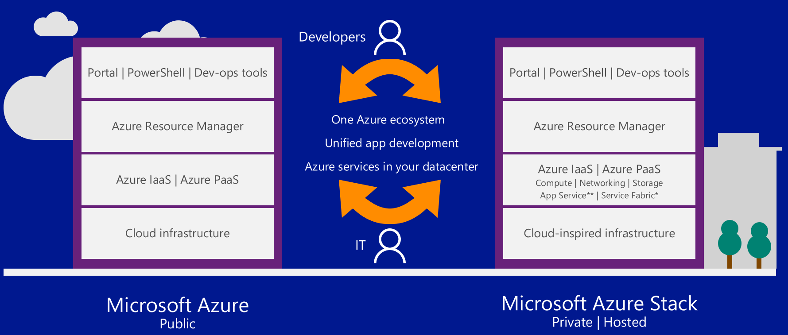
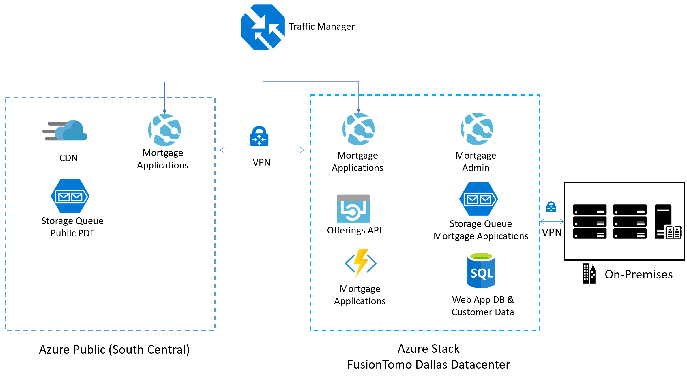



Azure Stack

 Whiteboard design session trainer guide

December 2018

Information in this document, including URL and other Internet Web site references, is subject to change without notice. Unless otherwise noted, the example companies, organizations, products, domain names, e-mail addresses, logos, people, places, and events depicted herein are fictitious, and no association with any real company, organization, product, domain name, e-mail address, logo, person, place or event is intended or should be inferred. Complying with all applicable copyright laws is the responsibility of the user. Without limiting the rights under copyright, no part of this document may be reproduced, stored in or introduced into a retrieval system, or transmitted in any form or by any means (electronic, mechanical, photocopying, recording, or otherwise), or for any purpose, without the express written permission of Microsoft Corporation.

Microsoft may have patents, patent applications, trademarks, copyrights, or other intellectual property rights covering subject matter in this document. Except as expressly provided in any written license agreement from Microsoft, the furnishing of this document does not give you any license to these patents, trademarks, copyrights, or other intellectual property.

The names of manufacturers, products, or URLs are provided for informational purposes only and Microsoft makes no representations and warranties, either expressed, implied, or statutory, regarding these manufacturers or the use of the products with any Microsoft technologies. The inclusion of a manufacturer or product does not imply endorsement of Microsoft of the manufacturer or product. Links may be provided to third party sites. Such sites are not under the control of Microsoft and Microsoft is not responsible for the contents of any linked site or any link contained in a linked site, or any changes or updates to such sites. Microsoft is not responsible for webcasting or any other form of transmission received from any linked site. Microsoft is providing these links to you only as a convenience, and the inclusion of any link does not imply endorsement of Microsoft of the site or the products contained therein.
© 2018 Microsoft Corporation. All rights reserved.

Microsoft and the trademarks listed at https://www.microsoft.com/en-us/legal/intellectualproperty/Trademarks/Usage/General.aspx are trademarks of the Microsoft group of companies. All other trademarks are property of their respective owners.

**Contents**

<!-- TOC -->

- [Trainer information](#trainer-information)
    - [Role of the trainer](#role-of-the-trainer)
    - [Whiteboard design session flow](#whiteboard-design-session-flow)
    - [Before the whiteboard design session: How to prepare](#before-the-whiteboard-design-session-how-to-prepare)
    - [During the whiteboard design session: Tips for an effective whiteboard design session](#during-the-whiteboard-design-session-tips-for-an-effective-whiteboard-design-session)
- [Azure Stack whiteboard design session student guide](#azure-stack-whiteboard-design-session-student-guide)
    - [Abstract and learning objectives](#abstract-and-learning-objectives)
    - [Step 1: Review the customer case study](#step-1-review-the-customer-case-study)
        - [Customer situation](#customer-situation)
        - [Customer needs](#customer-needs)
        - [Customer objections](#customer-objections)
        - [Infographic for common scenarios](#infographic-for-common-scenarios)
    - [Step 2: Design a proof of concept solution](#step-2-design-a-proof-of-concept-solution)
    - [Step 3: Present the solution](#step-3-present-the-solution)
    - [Wrap-up](#wrap-up)
    - [Additional references](#additional-references)
- [Azure Stack whiteboard design session trainer guide](#azure-stack-whiteboard-design-session-trainer-guide)
    - [Step 1: Review the customer case study](#step-1-review-the-customer-case-study)
    - [Step 2: Design a proof of concept solution](#step-2-design-a-proof-of-concept-solution)
    - [Step 3: Present the solution](#step-3-present-the-solution)
    - [Wrap-up](#wrap-up)
    - [Preferred target audience](#preferred-target-audience)
    - [Preferred solution](#preferred-solution)
    - [Checklist of preferred objection handling](#checklist-of-preferred-objection-handling)
    - [Customer quote (to be read back to the attendees at the end)](#customer-quote-to-be-read-back-to-the-attendees-at-the-end)

<!-- /TOC -->

# Trainer information

Thank you for taking time to support the whiteboard design sessions as a trainer!

## Role of the trainer

An amazing trainer:

-   Creates a safe environment in which learning can take place.

-   Stimulates the participant's thinking.

-   Involves the participant in the learning process.

-   Manages the learning process (on time, on topic, and adjusting to benefit participants).

-   Ensures individual participant accountability.

-   Ties it all together for the participant.

-   Provides insight and experience to the learning process.

-   Effectively leads the whiteboard design session discussion.

-   Monitors quality and appropriateness of participant deliverables.

-   Effectively leads the feedback process.

## Whiteboard design session flow 

Each whiteboard design session uses the following flow:

**Step 1: Review the customer case study (15 minutes)**

**Outcome**

Analyze your customer's needs.

-   Customer's background, situation, needs and technical requirements

-   Current customer infrastructure and architecture

-   Potential issues, objectives and blockers

**Step 2: Design a proof of concept solution (60 minutes)**

**Outcome**

Design a solution and prepare to present the solution to the target customer audience in a 15-minute chalk-talk format.

-   Determine your target customer audience.

-   Determine customer's business needs to address your solution.

-   Design and diagram your solution.

-   Prepare to present your solution.

**Step 3: Present the solution (30 minutes)**

**Outcome**

Present solution to your customer:

-   Present solution

-   Respond to customer objections

-   Receive feedback

**Wrap-up (15 minutes)**

-   Review preferred solution

## Before the whiteboard design session: How to prepare

Before conducting your first whiteboard design session:

-   Read the Student guide (including the case study) and Trainer guide.

-   Become familiar with all key points and activities.

-   Plan the point you want to stress, which questions you want to drive, transitions, and be ready to answer questions.

-   Prior to the whiteboard design session, discuss the case study to pick up more ideas.

-   Make notes for later.

## During the whiteboard design session: Tips for an effective whiteboard design session

**Refer to the Trainer guide** to stay on track and observe the timings.

**Do not expect to memorize every detail** of the whiteboard design session.

When participants are doing activities, you can **look ahead to refresh your memory**.

-   **Adjust activity and whiteboard design session pace** as needed to allow time for presenting, feedback, and sharing.

-   **Add examples, points, and stories** from your own experience. Think about stories you can share that help you make your points clearly and effectively.

-   **Consider creating a "parking lot"** to record issues or questions raised that are outside the scope of the whiteboard design session or can be answered later. Decide how you will address these issues, so you can acknowledge them without being derailed by them.

***Have fun**! Encourage participants to have fun and share!*

**Involve your participants.** Talk and share your knowledge but always involve your participants, even while you are the one speaking.

**Ask questions** and get them to share to fully involve your group in the learning process.

**Ask first**, whenever possible. Before launching into a topic, learn your audience's opinions about it and experiences with it. Asking first enables you to assess their level of knowledge and experience, and leaves them more open to what you are presenting.

**Wait for responses**. If you ask a question such as, "What's your experience with (fill in the blank)?" then wait. Do not be afraid of a little silence. If you leap into the silence, your participants will feel you are not serious about involving them and will become passive. Give participants a chance to think, and if no one answers, patiently ask again. You will usually get a response.

#  Azure Stack whiteboard design session student guide

## Abstract and learning objectives 

In this whiteboard design session, you will work with a group to design a hybrid cloud architecture using a combination of the Azure public cloud and Azure Stack. This functional architecture will enable customers to leverage their investments in Azure as a "cloud platform," rather than Azure as a "place."

At the end of the session, you will be able to determine which systems are good candidates for the Azure public cloud, and which are better suited on Azure Stack.

## Step 1: Review the customer case study 

**Outcome**

Analyze your customer's needs.

Timeframe: 15 minutes

Directions: With all participants in the session, the facilitator/SME presents an overview of the customer case study along with technical tips.

1.  Meet your table participants and trainer.

2.  Read all of the directions for steps 1-3 in the student guide.

3.  As a table team, review the following customer case study.

### Customer situation

Contoso Finance is one of the largest banks in the United States with a significant amount of their revenue coming from their residential mortgage business. Their mortgage business is headquartered in Dallas, Texas. During a meeting with the newly appointed CTO Doreen Newton, the IT team learned that Contoso is shifting to a cloud first strategy after seeing firsthand the advantages of the cloud from Doreen's previous role leading her prior company through a digital transformation. Her message, "I have seen how applications and infrastructures are deployed and run using Microsoft Azure with both PaaS and IaaS services. These capabilities can transform Contoso with more agility and long-term cost effectiveness." resonated with other members of the IT organization.

Contoso's current systems run in their Dallas based datacenter hosted in VMWare based virtual machines. One of the primary applications they are interested in modernizing to take advantage of the cloud is their consumer facing mortgage application. This application is responsible for new applications and consumer access to their current mortgage information. The mortgage app is hosted in a public facing website on Microsoft Internet Information Server (IIS) with a backend database using SQL Server 2012. The application has several modules that run as Windows Services. These modules are responsible for running credit checks and generating PDFs for transactions. The application uses Microsoft Message Queue (MSMQ) for interacting between modules. The application also allows customers to download several publicly accessible PDF files that are brochures for their products.

During the planning stages, Contoso realized they would not be able to retain their customer data in US based Azure regions due to corporate compliance policies and regulatory issues. "This was a cause for great concern, as this means Contoso may not be able to move to cloud-based services as fast as we initially envisioned" says Max Rubin VP of Network Engineering. Doreen Newton took on the challenge to investigate alternatives to allow Contoso to proceed with getting the benefits of the cloud while not breaking rules for corporate compliance.

As a result, Contoso has engaged a Microsoft Cloud Partner and Service Provider FusionTomo (FT), to help them design a solution using Azure technologies. FT is a full-service hosting provider in North America certified to deliver Azure services with connectivity solutions and partnerships to provide ExpressRoute and other telecom services. They have datacenters located in Denver, London, Las Vegas, Dallas and Hong Kong SAR.

Contoso has expressed to FT the need to embrace Microsoft Azure technologies as well as technologies that will help their organization with a more agile continuous integration and continuous deployment model for application deployment.

With the goals in mind, Contoso has challenged FT to help use their mortgage application as the first application to be used with Microsoft Azure.

### Customer needs 

Contoso is looking for FT to provide the following for their expansion into North America:

1.  Design a hybrid-cloud architecture that is native Azure end-to-end without the need for hosting the application in a Contoso owned datacenter.

2.  The design should ensure that customer data is not stored in the Azure Cloud while also allowing future applications to be easily deployed in Azure with access to custom data regardless of where they are deployed.

3.  Deploy the application in a secure manner as to allow for the frontend applications to access the backend customer data.

4.  Establish direct connectivity from the new regional headquarters in Dallas to the deployments. This will allow communication with existing systems and reporting until the rest of Contoso's services are moved to Azure in the future.

5.  Allow for a consistent application deployment model using Azure ARM templates and CI/CD.

6.  Detail the taxonomy that will be leveraged for the hybrid-cloud including the Resource Providers (RP) This includes tenants, regions, subscriptions, offers, plans, services and quota.

### Customer objections 

1.  The Mortgage SQL DB cannot be hosted in the public cloud.

2.  Contoso staff is already stretched thin, so minimizing patching of systems and day-to-day management is very important.

3.  The developer team acknowledges that the existing application architecture is designed for running on Windows Virtual Machines, but PaaS is the future they envision. How can they move this application forward?

4.  One of the key reasons Contoso wants to go to the cloud is to take advantage of tools and services for automated deployments and application development. Will Azure Stack make it to where we must use two skillsets?

### Infographic for common scenarios

## Step 2: Design a proof of concept solution

**Outcome**

Design a solution and prepare to present the solution to the target customer audience in a 15-minute chalk-talk format.

Timeframe: 60 minutes

**Business needs**

Directions:  With all participants at your table, answer the following questions and list the answers on a flip chart:

1.  Who should you present this solution to? Who is your target customer audience? Who are the decision makers?

2.  What customer business needs do you need to address with your solution?

**Design**

Directions: With all participants at your table, respond to the following questions on a flip chart:

Design a hybrid-cloud architecture using Azure services that will make up the implementation for Contoso.

1.  Identify the overall application design you would propose for modernizing their existing application into Azure.

2.  List the services and components that will be deployed to Azure public cloud. For each, provide their basic function in the system. Determine which Azure Region will be best suited for the deployment.

3.  List the services and components that will be deployed to Azure Stack Cloud. For each, provide their basic function in the system.

Identify how applications such as the Mortgage App and other infrastructure workloads could be deployed in a consistent manner between Azure Public and Azure Stack.

Plan and Document Azure Stack taxonomy for this deployment.

1.  Document each of the following areas of the taxonomy with details on how it will be setup:

    -   Cloud Operator

    -   Region

    -   Tenant

    -   Subscriptions

    -   Plans and quotas

    -   Offers

    -   Services / Resource Providers

2.  Diagram your taxonomy.

Create a network design.

1.  Design network connectivity between the Contoso Regional HQ in Dallas to Azure and Azure Stack that will allow future applications to be deployed in the public cloud or Azure Stack but still provide connectivity to customer or On-Premises data.

**Prepare**

Directions: With all participants at your table:

1.  Identify any customer needs that are not addressed with the proposed solution.

2.  Identify the benefits of your solution.

3.  Determine how you will respond to the customer's objections.

Prepare a 15-minute chalk-talk style presentation to the customer.

## Step 3: Present the solution

**Outcome**

Present a solution to the target customer audience in a 15-minute chalk-talk format.

Timeframe: 30 minutes

**Presentation**

Directions:

1.  Pair with another table.

2.  One table is the Microsoft team and the other table is the customer.

3.  The Microsoft team presents their proposed solution to the customer.

4.  The customer makes one of the objections from the list of objections.

5.  The Microsoft team responds to the objection.

6.  The customer team gives feedback to the Microsoft team.

7.  Tables switch roles and repeat Steps 2-6.

##  Wrap-up 

Time frame: 15 minutes

Directions: Tables reconvene with the larger group to hear the facilitator/SME share the preferred solution for the case study.

##  Additional references
|    |            |
|----------|:-------------:|
| **Description** | **Links** |
| Azure Stack overview  | <https://azure.microsoft.com/en-us/overview/azure-stack/> |
| Azure Stack use cases | <https://azure.microsoft.com/en-us/overview/azure-stack/use-cases/> |
| Azure Stack features | <https://docs.microsoft.com/en-us/azure/azure-stack/azure-stack-key-features> |
| Azure Stack planning considerations | <https://docs.microsoft.com/en-us/azure/azure-stack/azure-stack-planning-considerations> |
| Azure Stack documentation | <https://docs.microsoft.com/en-us/azure/azure-stack/> |
| Azure Stack Operator documentation | <https://docs.microsoft.com/en-us/azure/azure-stack/> |
| Azure Stack networking | <https://docs.microsoft.com/en-us/azure/azure-stack/user/azure-stack-network-overview/> |
| Azure Stack to Azure Global VPN | <https://docs.microsoft.com/en-us/azure/azure-stack/azure-stack-connect-vpn> |
| Register Azure Stack with your subscription | <https://docs.microsoft.com/en-us/azure/azure-stack/azure-stack-register> |
| Deploy the Azure Stack App Service resource provider | <https://docs.microsoft.com/en-us/azure/azure-stack/azure-stack-app-service-deploy> |
| Deploy the Azure Stack SQL resource provider | <https://docs.microsoft.com/en-us/azure/azure-stack/azure-stack-sql-resource-provider-deploy#deploy-the-resource-provider> |
| Deploy apps to Azure and Azure Stack | <https://docs.microsoft.com/en-us/azure/azure-stack/user/azure-stack-solution-pipeline> |
| White paper | <https://azure.microsoft.com/en-us/resources/azure-stack-an-extension-of-azure/> |
| PowerShell for Azure Stack | <https://docs.microsoft.com/en-us/azure/azure-stack/user/azure-stack-powershell-install> |
| Azure Stack marketplace | <https://docs.microsoft.com/en-us/azure/azure-stack/azure-stack-marketplace-azure-items> |

# Azure Stack whiteboard design session trainer guide

## Step 1: Review the customer case study

-   Check in with your table participants to introduce yourself as the trainer.

-   Ask, "What questions do you have about the customer case study?"

-   Briefly review the steps and timeframes of the whiteboard design session.

-   Ready, set, go! Let the table participants begin.

## Step 2: Design a proof of concept solution

-   Check in with your tables to ensure that they are transitioning from step to step on time.

-   Provide some feedback on their responses to the business needs and design.

    -   Try asking questions first that will lead the participants to discover the answers on their own.

-   Provide feedback for their responses to the customer's objections.

    -   Try asking questions first that will lead the participants to discover the answers on their own.
    
## Step 3: Present the solution

-   Determine which table will be paired with your table before Step 3 begins.

-   For the first round, assign one table as the presenting team and the other table as the customer.

-   Have the presenting team present their solution to the customer team.

    -   Have the customer team provide one objection for the presenting team to respond to.

    -   The presentation, objections, and feedback should take no longer than 15 minutes.

    -   If needed, the trainer may also provide feedback.

## Wrap-up

-   Have the table participants reconvene with the larger session group to hear the facilitator/SME share the following preferred solution.

##  Preferred target audience

-   Doreen Newton, CTO

-   Max Rubin, VP of Networks

-   Contoso teams:

    -   Networking, security, development, DevOps and application owners

-   FT Teams

    -   Azure Stack, networking

## Preferred solution

After being engaged by Contoso and gathering the requirements from the client, FT has put forward a design which embraces the Azure platform, DevOps for development and deployment, and the data sovereignty issues discovered by Contoso (no customer data in the public cloud). The solution consists of using Azure public cloud in the South-Central Region and Azure Stack running in a FT Dallas datacenter.

Design a hybrid-cloud architecture using Azure services that will make up the implementation for Contoso:

1. Identify the overall application design you would propose for modernizing their existing application into Azure.

    -   Azure Web Apps and API Apps will replace the IIS servers for hosting the website and associated APIs.

    -   Azure Blob Storage will be used for storage of private and public PDF files.

    -   Azure Storage Queues would replace passing messages using MSMQ.

    -   Azure Functions will replace the Windows Services.

    -   Azure SQL Database will replace the existing SQL Servers.

    -   Azure Traffic Manager will be configured in Priority mode to route web traffic to either the Azure public Web App or the Web App on Azure Stack.

    -   Azure Content Deployment Network (CDN) to allow public files such as PDFs to be routed closer to customers for a faster download experience.

2. List the services and components that will be deployed to Azure public cloud. For each, provide their basic function in the system. Determine which Azure Region will be best suited for the deployment.

    -   Azure public cloud: The South-Central Region will be used for public facing applications allowing the reuse of all of the code currently being run in production in Europe and Australia. The following applications will be deployed to Azure Global Cloud:

        -   Mortgage Application Web App

        -   Azure Storage for publicly accessible PDF files.

        -   Azure CDN for hosting publicly accessible PDF files.

3. List the services and components that will be deployed to Azure Stack Cloud. For each, provide their basic function in the system.

    -   A new Azure Stack Region will be deployed into the FusionTomo datacenter in Dallas, TX. The following applications and VMs will be deployed into Azure Stack:

        -   Azure Stack SQL Database for the Web App DB and Customer Data. This will require the Azure Stack SQL DB Resource Provider to be installed.

        -   Mortgage Applications and Mortgage Admin: Offers API, and Function App will be deployed to Azure App services in an Azure App Service Environment (due to ExpressRoute integration with Azure Stack). This will require the Azure Stack Azure App Resource Provider to be installed.

        -   Azure Blob Storage for PDFs.

        -   Azure Queue Storage for the Mortgage Application messaging.

Identify how applications such as the Mortgage App and other infrastructure workloads could be deployed in a consistent manner between Azure public cloud and Azure Stack.

Azure Resource Manager templates can be used to deploy supported services to both Azure public cloud and Azure Stack.

A hybrid continuous integration/continuous delivery(CI/CD) pipeline enables you to build, test, and deploy your app to multiple clouds. A hybrid CI/CD pipeline can help you:

-   Initiate a new build based on code commits to your Visual Studio Team Services (VSTS) repository.

-   Automatically deploy your newly built code to Azure for user acceptance testing.

-   Once your code has passed testing, automatically deploy to Azure Stack.

Plan and Document Azure Stack Taxonomy for this deployment.

-   **Cloud operator**: FT will act as in this role as the Service Provider. FT will create and maintain the Azure Stack Infrastructure. This will include building out the hardware, software, and plans, offers and services of the taxonomy. Only FT will be able to access the Administrator Portal for the Azure Stack private cloud. Contoso will have access to use the service via the User Portal to build, manage and secure their deployments.

-   **Region**: One Azure Stack region would be created in the FT datacenter for Contoso's operations in North America.

-   **Tenant**: Contoso will be setup as the sole tenant for their US based operations. This could be expanded to other tenants if they decided to enter other countries or regions such as Mexico, Canada or the Caribbean. This tenant will be able to use all of the offers and services detailed in the rest of this taxonomy. (If further separation is required, then another Region would have to be deployed.)

-   **Subscriptions**: There will be at least two subscriptions, but the number is a decision that can be left to Contoso to create. The two types will be Production and Development to isolate the billing and charges from each of these deployments.

-   **Plans and quotas**: Plans are groupings of one or more services. As the provider, FT will create plans to offer to the Contoso tenant. The Contoso services will be enabled on two plans: production and development. All services will be allowed for each plan to support Contoso DevOps practices. Each service added to a plan can be configured with quota settings, and the Production and Development Plans will have different quotas. The quotas on the Development plan will be limited as to ensure that the production deployment is not starved of resources it might need.

-   **Offers**: There will be two offers for production and development. These will be assigned their respective Plan for Production and Development.

-   **Services/Resource Providers (RP)**: The base Resource Providers: Compute RP, Network RP, Storage RP and KeyVault RP will all be enabled. The SQL Server RP will be enabled and configured. The Azure App RP will be enabled and configured (The Windows Server 2016, SQL Server 2017, SQL IaaS Extension for Azure Stack).

    

1. Design Network connectivity between the Contoso Regional HQ in Dallas to Azure and Azure Stack that will allow future applications to be deployed in the public cloud or Azure Stack and still provide connectivity to customer or On-Premises data.

-   The initial proof of concept will start with providing a S2S VPN between the virtual network the Azure Web App is connected to and Azure Stack and another S2S Gateway between the Azure Stack datacenter in FT and the Contoso Regional HQ.

-   For the future, both S2S and ExpressRoute will be configured for routing using BGP ensuring the best connections possible and one set of configurations for routing. FT will provide the Public ASN number for the routes from their datacenter network in Dallas. FT will also configure the BGP connections between their datacenter and the new routers On-Premises at the Contoso Dallas office. Contoso's Public IP Space will be leveraged along with the addition of Public IP space from FT.

## Checklist of preferred objection handling

1.  The Mortgage SQL DB cannot be hosted in the public cloud.

    **Potential Answer:**

    The SQL Database containing the customer information will be hosted in Azure Stack in the FT datacenter. This will require the SQL DB Resource Provider to be running on Azure Stack. The data will never reside in the Azure Global Cloud.

2.  Contoso will have a very limited staff to manage the US based operations, so minimizing patching of systems and day-to-day management is very important.

    **Potential Answer:**

    All of the services that are used for this application in both Azure Global and Azure Stack leverage PaaS services. As a result, there is very limited need for management of the platforms beyond the application.

3.  The developer team acknowledges that the existing application architecture is designed for running on Windows Virtual Machines, but PaaS is the future they envision. How can they move this application forward?

    **Potential Answer:**

    The application code base can be modernized by converting the Windows Services to Azure Functions, messaging based code could use Azure Storage Queues or Service Bus, and code that reads and writes from the file system could be updated to use Azure Storage. Finally, application code that writes to SQL Server could be updated to use SQL Database.

4.  One of the key reasons Contoso wants to go to the cloud is to take advantage of tools and services for automated deployments and application development. Will Azure Stack make it to where we must use two skillsets?

    **Potential Answer:**

    While there will be minor differences with connectivity/environment information, if the resources are supported in both clouds, the developer and tooling experience will be consistent.

## Customer quote (to be read back to the attendees at the end)

"Our plans to enter the North American Mortgage market were enabled by our Partner, FusionTomo helping us to leverage our investment in Azure as a platform with Azure Stack. We can move forward with our project timelines."

-   Doreen Newton, CTO
